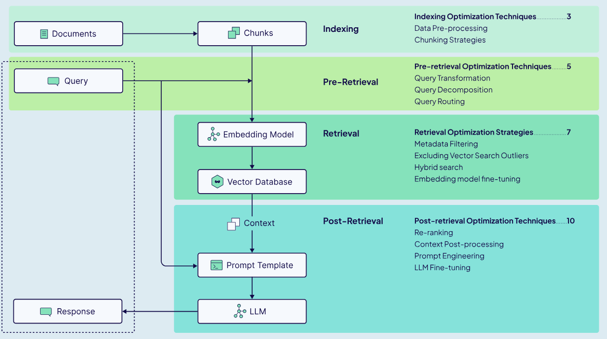

::: {.hidden}

## Some limitations of LLMs 

General limitations:

- explainability and transparency of output : black-box effect.
- stochastic : not reliable answers
- deciphering the user intention (the query) 
- training on specific task requires a lot of annotated data

Specific problems:

- memory problem : implicit knowledge base that cannot easily be expanded or revised, 
- limited context window (if some companies boast 120k-input-token-window models, their performance still lags beyond 30k tokens [@shankarApplicationCentricAIEvals2025]). 
:::

##  RAG 

Key point: Retrieval Augmentated Generation is an architecture for AI-integrated systems. It relies on an external knowledge base to improve on the overall quality of a generative LLM's output.

> a foundational architecture in modern LLM systems" 
> ---[@shankarApplicationCentricAIEvals2025]




::: {.hidden}
## The original RAG paper

Original paper by @lewisRetrievalAugmentedGenerationKnowledgeIntensive2021

Authors from:

- Facebook AI Research
- University College London
- New York University 

NB: Before the launch of ChatGPT (GPT-3.5 in nov. 2022). They use BART and GPT-2. 

Key elements : 

- parametric memory = the model: pre-trained `seq2seq` (early Transformers architecture). 
- non-parametric memory = external knowledge base: dense vector index of Wikipedia 
- IR strategy = encoder-decoder: pre-trained neural retriever. No supervision of the document that should be retrieved. 

<div style="font-size: 50%;">
Comments: 

- Retrieval ablation shows that although a learned retrieval improves results on all tasks, the fack-checking (against Wikipedia) dataset FEVER performs best with a BM25 (improved TF-iDF). 
</div>
:::

# What limitations of foundational LLMs can RAG solve ?

## What limitations of foundational LLMs can RAG solve ?

- **Reliability and transparency (for the dev)**: providing a specialized and human verified external knowledge source ensures that the model will output based on those elements rather than it's implicit knowledge base. 
- **Better reproducibility**: traceable sources and choice of IR strategy. 
- **Preservation of the general-purpose and adaptability of foundational LLMs**: doesn't require special training or fine-tuning on a specific task. 

# What can be some limits of RAG ? 

##  What can be some limits of RAG ?

Higher level problems:

- **Dataset biais**: External knowledge base = dataset with its bias and limitations too. 
- **Cost**: Adding to regular prompt engineering: encoding the external knowledge base, DBB storage, eval and maintenance of a complex system, longer prompts containing extra info.
- **Latency**: pipeline = increased response time.
- **Complexity**: Many parameters = complex evaluation and optimization: IR strategy (TF-iDF/BM25 or semantic search with vector proximity, neural retrievers), chunk size, number of chunks provided and ranking algorithm (top-k). 

Internal problems:

- **Information dissemination**: what if the chunks needed end up being too big or numerous for the LLM to be competent? 
- **'Blind spot' effect**: if the key information is in a chunk not retrieved, then that part is lost to the user. 

::: {.incremental}

- <div style="font-size: 200%;">**Evaluation : each step of the pipeline can cause failures**</div>

:::
## Evaluating RAG: when and where

::: {.figure}

:::


## @shankarApplicationCentricAIEvals2025 recommendations for RAG Evaluation

General recommendations for evaluation: 

- Identify where the pipeline weakens (or where it breaks)
- Evaluate at each step 
- **Form an evaluation dataset of expected queries, retrieved context and gold-standard answers**

<!-- 
<div style="font-size: 50%;">
Specific recommendations:

- chunking strategies (size, overlap, method (fixed window, sentence, advanced semantic segmentation))
    - perform a grid search on every combination possible 
    - leverage the document structure and metadata (augment each chunk with section heading and doc title for example) 
</div> 

Metrics for each step:

- Retrieval metrics: Recall@k and NDCG@k. 
- Reranking metrics: MRR or NDCG
- Final output: faithfulness and relevance metrics (ARES framework [@saad-falcon-etal-2024-ares])

Reminder: 

- Recall = did we catch all relevant document
- Precision = were all the document retrieved relevant. 
- MRR : Mean Reciprocal Rank: measures how early the first relevant doc appears in the ranking. Score 1/top-k if doc is in top-k otherwise 0. 
- NDCG@k : Normalized Discounted Cumulative Gain: grading relevance for ranking. Rewards placing more relevant items higher. Essentially, compares docs to each other to figure out which is more relevant. -> might produce counterintuitive scores ex: if all docs are irrelevant but ranked in the right order would give a high score. OR would  give a lower score if the best possible doc is retrieved but ranked lower even though that only doc is essential. 
-->

## Reference-based evaluation pros and cons

pros|cons|
---|---
control of output from expected user behaviour|user query might not fit expected queries ( e.g. edge cases and jailbreak attempts)
fixed dataset means that different prompting strategies can be assessed over time|annotation is time consuming

# What are some tasks where a reference answer or 'gold-standard answer' might not be available ? 

## What are some tasks where a reference answer might not be available ? 

- Open-ended queries
- Summarization
- Interpretative tasks
- Changing context

# Proposed solution: RAGAS

## Article 
::: {.figure}


Submitted on **26 Sep 2023 (v1)**, last revised 28 Apr 2025 (this version, v2) on [arXiv](https://arxiv.org/abs/2309.15217). 
:::

## Authors 
::: {.figure}


:::

- Exploding Gradients : private company that built RAGAS (open-source oriented)
- CardiffNLP : Schockaert: worked on EvoPrompt. 
- [AMPLYFI](https://amplyfi.com/): private company for market insights 


## RAGAS in a nutshell

Key element: **Reference-free (not tied to having ground truth available) evaluation framework for retrieval agumented generation**

Essentially: a series of prompts to decompose the evaluation for specific aspects of the RAG (faithfulness, answer relevance, context relevance). 

Integration: `llama-index` and `Langchain`. 

Available: [https://github.com/explodinggradients/ragas](https://github.com/explodinggradients/ragas)

Ratings: 11.1k stars on GitHub 

## RAGAS in a nutshell


## Evaluation of the final output

- Faithfulness: **The answer should be grounded in provided context.**    
    - hallucinations
    - omissions
    - misinterpretation

Answer Relevance: **The generated answer should address the actual question.**

Context Relevance: **Retrieved context should be focused, containing as little irrelevant information as possible.**


## Faithfulness eval with RAGAS

**The answer should be grounded in provided context**

::: {style="color: green;"}
**Example: You have designed a RAG system to help you with your courses notes. You want to make sure that the IA-system answers based on the content of the course as it is very advanced knowledge and not from unreliable sources (the web).**
:::

Strategy: 

1. Create statements from the output given a user query. 

Prompt: 

>```Given a question and answer, create one or more statements from each sentence in the given 
> answer. \n question: [question] answer: [answer]```

::: {style="color: green;"}
Question = query = **"Can you summarize last week's course?"**

Answer = output = 

**"Here’s a concise summary of your Week 8 – AI Agent Architecture course content:** 

 - **Agents are autonomous systems that:**

    - **Interact not only with users but also with each other and their environment.**
    - **Go beyond simple LLM + tool use (sometimes called a "single agent")."**


Statements created for evaluation = 

1. **"The course discussed in Week 8 is titled "AI Agent Architecture."**

2. **"The week focused on the structure, interaction, and evolution of AI agents."**

3. **"Agents are autonomous systems."**

4. **"Agents interact with users, other agents, and their environment."**

:::

2. LLM-as-judge to evaluate the statement against the retrieved context.

Prompt: 

>```Consider the given context and following statements, then determine whether they are supported by the information present in the context. Provide a brief explanation for each statement before arriving at the verdict (Yes/No). Provide a final verdict for each statement in order at the end in the given format. Do not deviate from the specified format. statement: [statement 1] ...  statement: [statement n]```


::: {style="color: green;"}
Context: **course.md week1, week8, week _n_,  syllabus.xslx chunk 1, chunk _n_.**

Statement to assess : **"The course discussed in Week 8 is titled "AI Agent Architecture."**

Evaluation output : **"Chunk 1 of the Syllabus provided does mention that the topic of Week 8 is AI Agent Architecture. Verdict : Yes"**

::: 

**Metric : supported statements/total number of statements**

## Answer Relevance

**The generated answer should address the actual question.**

Strategy: Retro-engineering what the question could have been from the answer. 

```Generate a question for the given answer. answer: [answer]```

::: {style="color: green;"}

From the output summary: 

Possible Question: **"What are the key concepts, models, and research papers covered in *Week 8 – AI Agent Architecture*, and how do they illustrate the evolution from single LLM-based systems to multi-agent ecosystems?"**

**To be compared with the actual query: "Can you summarize last week's course?"**
:::

**Metric : Cosine similarity between the actual question and the generated answer.**


## Context Relevance

**Retrieved context should be focused, containing as little irrelevant information as possible.**
<!-- 
This is important given the cost associated with feeding long context passages to LLMs. 

Replaces the ranking analysis suggested by Shankar.   -->

Strategy: Extracting sentences from the context that have could have been used to give the answer. 

Prompt: 

>```Please extract relevant sentences from the provided context that can potentially help answer the following question. If no relevant sentences are found, or if you believe the question cannot be answered from the given context, return the phrase "Insufficient Information". While extracting candidate sentences you’re not allowed to make any changes to sentences from given context.``` 

Helps analyse the granularity of the chunks provided and noise in the top-k (tells you whether there is anything relevant or not in the context). 

**Metric : number of extracted sentences/total number of sentences**

# Evaluation of the evaluation method

## Evaluation Dataset

**[WikiEval Dataset](https://huggingface.co/datasets/explodinggradients/WikiEval) : created for the purpose of RAGAS.**

Question/Answers created from 50 wiki pages (after 2022 to avoid reliance on implicit knowledge). 

1. Creation of the Question

Prompt: 

>```Your task is to formulate a question from given context satisfying the rules given below: 1. The question should be fully answered from the given context. 2. The question should be framed from a part that contains non-trivial information. 3. The answer should not contain any links. 4. The question should be of moderate difficulty. 5. The question must be reasonable and must be understood and responded to by humans. 6. Do not use phrases that ’provided context’, etc in the question context:```

2. Generation of the Answer

Prompt:

>```Answer the question using the information from the given context. question: [question] context: [context]```

3. Annotation by 2 humans with interannotation agreement reaching 95% (faithfulness and context relevance) and 90% (answer relevance). 


## Evaluation of the evaluation method

Their evaluation relies on the agreement of the method with a human annotator based on pairwise comparisons != absolute scores. 

|question|answer A|answer B|context|
----|----|----|------------|
When is the **scheduled launch date and time** for the PSLV-C56 mission, and where will it be launched from?|The PSLV-C56 mission is scheduled to be launched on **Sunday, 30 July 2023 at 06:30 IST / 01:00 UTC.** It will be launched from the Satish Dhawan Space Centre, Sriharikota, Andhra Pradesh, India.|**The scheduled launch date and time for the PSLV-C56 mission have not been provided.**The PSLV-C56 mission is an important space mission for India. It aims to launch a satellite into orbit to study weather patterns.'|"The PSLV-C56 is the 58th mission of Indian Space Research Organisation's Polar Satellite Launch Vehicle (PSLV) and the 17th flight of the PSLV-CA variant, and will be get launched from Satish Dhawan Space Centre First Launch Pad ( FLP ).\n\nLaunch\nIt is Scheduled to get launched on Sunday, **30 July 2023 at 06:30 IST / 01:00 UTC** from Satish Dhawan Space Centre, Sriharikota, Andhra Pradesh, India. This is a dedicated commercial mission through NSIL with DS-SAR as primary satellite and VELOX-AM as a co-passenger satellite With other 5 Satellites, All satellites from this mission belongs to Singapore."|

Ragas is compared to : 

- GPT Score : for faithfulnes, range 0-10.

GPT Score Prompt: 

>```Faithfulness measures the information consistency of the answer against the given context. Any claims that are made in the answer that cannot be deduced from context should be penalized. Given an answer and context, assign a score for faithfulness in the range 0-10. context: [context] answer: [answer]```

- GPT Ranking: for answer relevancy, ranking. 

GPT Ranking Prompt:

>```Answer Relevancy measures the degree to which a response directly addresses and is appropriate for a given question. It penalizes the present of redundant information or incomplete answers given a question. Given an question and answer, rank each answer based on Answer Relevancy.  question: [question] answer 1: [answer 1] answer 2: [answer 2]```

## Evaluation results

::: {.figure}

:::

>« The results in Table 1 show that our proposed metrics are **much closer aligned with the human judgements than the predictions from the two baselines**. 

> For faithfulness, the Ragas prediction are in general highly accurate. 

> For answer relevance, the agreement is lower, but this is largely due to the fact that the differences between the two candidate answers are often very subtle. 

> We found context relevance to be the hardest quality dimension to evaluate. In particular, we observed that ChatGPT often struggles with the task of selecting the sentences from the context that are crucial, especially for longer contexts. » ([Es et al., 2025, p. 5](zotero://select/library/items/FJATA7IM)) ([pdf](zotero://open-pdf/library/items/3LHXZQXW?page=5&annotation=JY45VWXF))


## Other methods of RAG evaluation

Reference-based score:

- BERTScore
- MoverScore 

-> Comparison between vector of output and "golden standard" answer. 

Reference-less score:

- Asking ChatGPT to score the output (scale of 0 to 100) -> GPT Score and GPT Ranking
- ARES

## Difference between _Automated RAG Evaluation  System_ ARES framework and RAGAS
    
@saad-falcon-etal-2024-ares (a year after RAGAS).

Synthetic data generation (generating query‑passage‑answer triples) + fine‑tuned “judge” models + a small human annotated set + Prediction‑Powered Inference (PPI) to give confidence intervals, better ranking of RAG systems. 

Comment: much more complex to set-up, but better for robust eval (confidence intervals)


## Would you use RAGAS to evaluate your RAG? 


## Personal comments on RAGAS 

Strengths: 

- Reproducibility: they provide the prompts in full
- Clever workaround for the context relevance (with cosine similarity between query and retroengineered query). 
- Easy and intuitive implementation.

Limits: 

Evaluation of the evaluation method:

- The model used to create the dataset and to perform the ragas seems to be the same (namely ChatGPT without stating its version) : bias towards better performances at it would agree with itself more and create answer and questions that resemble more the kind of 'statements' it would generate. 
- Compared evaluation methods, GPT Score and GPT Ranking are not strong LLM-as-judge methods. 
- Limited dataset of 50 Q&A.


RAGAS as evaluation: 
- Splitting the answer into statements (faithfulness score) adds another layer of interpretation by the LLM, increasing chances of hallucinations etc.
- Lack of certainty assessment. 


## References