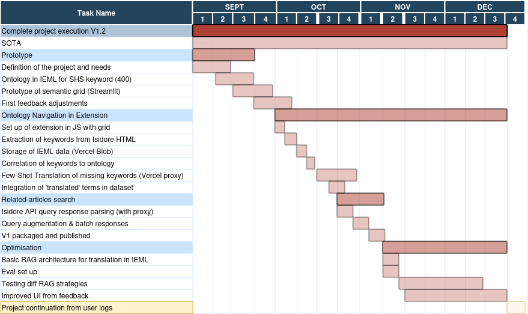

## Context

- Search engines for scientific literature.
- Recommender Systems (RS) based on :
    - annotated keywords
    - previous user searches and articles read -> filter bubbles [@pariserFilterBubbleWhat2011; @underwoodTheorizingResearchPractices2014] 
    - citation count -> citation concentration issue [@cardonDansLespritPageRank2013; @nielsenGlobalCitationInequality2021]
    - sometimes opaque 'IA assistant' [@tayReproducibilityInterpretabilityAcademic2025]

## Questions addressed and Solution proposed 

- What kind of RS could overcome these limits? 
    - sere ndipity (finding what you didn't know you didn't know)
    - using controlled vocabulary (Semantic Web langages)

- How to increase literacy in RS AI agents?
    - side by side comparison of search strategies

## Demo

[Example page](https://isidore.science/document/20.500.13089/k0dm)

---

---

## References

