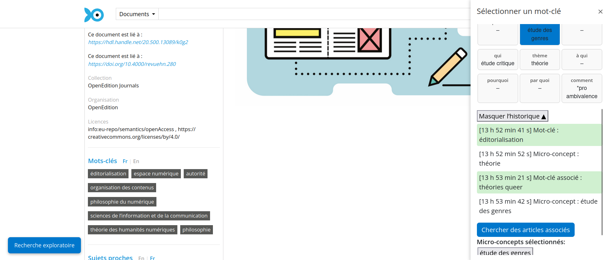

## Expérimentation du langage artificiel IEML pour la recherche d'articles scientifiques

Statut: en cours 

Responsables: Alexia Schneider, Pierre Lévy

---

### Contexte

Les moteurs de recherche et bases de données scientifiques :

- proposent des articles « similaires » sans expliciter les critères de rapprochement.
- s’appuient sur :

    - des algorithmes de classement favorisant les articles déjà populaires (ranking) et les auteurs les plus cités -> concentration des citations (Matthew's effect)
    - les intéractions précédentes des utilisateur.ice.s. -> _filter bubbles_ et biais de confirmation.
    - des _AI Assistant_ parfois opaques. 

-> perte de diversité scientifique, connaissances en silo disciplinaires.  

--- 

### Objectif de recherche 

Conception d'un système de recommandation explicable qui :

1. Favorise la sérendipité et l’exploration critique à partir d'un vocabulaire controllé et explicable.
2. Compare IA symbolique et IA connexionniste : visualise le résultat de recherches d'articles avec et sans 'IA'. 

---

### IEML comme base ontologique

Langage sémantique conçu par Pierre Lévy. 

Vocabulaire contrôlé et non ambigu

Chaque concept est décomposé selon 9 rôles sémantiques :
`thème ou process, qui, quoi, à qui, par quoi, quand, où, pourquoi, comment`

---

### Installation de l'extension sur Firefox

1. Télécharger le document depuis https://github.com/alexiaschn/ateliers_ia/blob/rs-ieml/rs_ieml-1.1.xpi : "Download raw file". 

2. Dans la barre du navigateur entrer `about:addons`.

3. Dans les paramètres : "Installer un module depuis un fichier"

4. Accepter l'installation de "Recommender System for Isisore based on IEML". 

---

### Perspectives 

- Retours utilisateurices : amélioration de l'interface
- Analyse des logs : étude de potentiels parcours exploratoires, 

---

---

---

---

---

