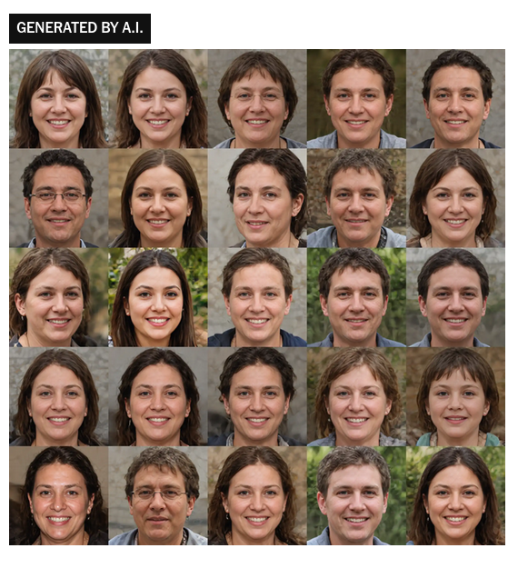

## *Révision ?* : une question de définition

Avant de savoir quel outil utiliser, il faut se demander ce qu'on veut faire

Une tension entre deux tâches qui prennent place dans deux espace-temps différents :  

- les protocoles éditoriaux établis au sein d'institutions et historicisables
- les pratiques de brouillonnages individuelles

## Changement de paradigme

_Grammar Error Correction_: tâche de Traitement Automatique de la Langue Naturelle, proche de la Traduction Automatique. 

- Correction évaluée à partir d'un _gold standard_ (phrase incorrecte v. phrase corrigée idéale)
- Complexité du système proportionnelle à la grammaire. 

Évolution de la correction automatique:

::: {.incremental}

1. Correction ortho-typographique 
2. Reformulation
3. Masquer l'utilisation d'une IA pour la génération de texte

:::

## Une question de système de valeurs

- Traitement de texte / outils de révision ➝ recherche de productivité
- On constate donc un changement dans dans les pratiques et les usages qui suivent ou sont suivies, on sait pas trop par l'évolution des outils
- *Quelle valeur on accorde au travail du texte ?* 
- *Un gain de temps ?* 
- *La rédaction académique : qu'implique la déprise du texte ? une déprise du sens ? Est-ce que l'idée est vraiment détachée de la forme ?*

# Risques et limites à l'utilisation de LLM pour la correction 

## Homogénéisation de la langue

<!--est-ce que ça te va si je te laisse cette slide ? Tu expliques rapidement la problématique de l'autophagie et de l'entraînement sur des données synthétiques, pas nécessaire de faire un point sociolinguistique, je pense.-->

1. le LLM reflète des données d'entraînement mais aussi les phases de _reinforcement learning_ qui l'oriente vers certains comportements standards porteurs de normes (ex: Français parisien) [@lodgeFrenchDialectStandard1993].
2. S'il est possible de demander à un LLM de changer son comportement, il est ramené vers ses paramètres généraux : c'est "l'attraction par défaut" [@paschalidisVersLangageSans2025]. 
3. La portion croissante de données synthétiques dans les jeux d'entraînement de ses modèles renforce leurs biais (perte de diversité) et rends les réponses des modèles moins fiables (effondrement). 

---

:::: {.columns}

::: {.column width="45%"}

:::

::: {.column width="5%"}

:::

::: {.column width="45%"}

:::

::::

## Hypercorrection ?

##  Un idéal de clarté qui finit par s’auto-parodier (le fameux *style chatgpt*) 

> We show that while the core content of texts is retained when LLMs polish and rewrite texts, **not only do they homogenize writing styles, but they also alter stylistic elements in a way that selectively amplifies certain dominant characteristics or biases while suppressing others - emphasizing conformity over individuality**. By varying LLMs, prompts, classifiers, and contexts, we show that these trends are robust and consistent. 
[@sourati2025shrinkinglandscapelinguisticdiversity]

*Si une formulation est fortement présente dans le corpus d'entraînement est-ce que c'est nécessairement la meilleure ? L'approche par défaut vaut-elle pour tous les contextes ?*

Il y a des contextes dans lesquels la langue se doit d'être normée : contexte académique. 

## Effet nivelant et autorité de la machine ?

La délégation de la tâche de relecture et des tâches associées à la correction (traduction, mise en page) a un effet nivelant. 

Les moins bons traducteurs sont aidés par la TA mais les meilleurs traducteurs sont désavantagés par la TA. Effet limitant car tendance à se laisser influencer : réduction des intuitions de traduction et de la créativité traductionnelle. [@schumacherPosteditionTraductionAutomatique2023]

La délégation cognitive et l'influence que ces machines ont sur nous individuellement n'est pas négligeable (voir @vicenteHumansInheritArtificial2023). 

## Conclusion

**Les outils incarnent une vision du monde centrée sur la productivité et la rapidité**

*Assiste-t-on a une déprise tu texte et à une déprise du sens ? Existe-t-il un seuil, une limite, au-delà de laquelle le recours aux LLMs constitue une perte de maîtrise du texte ?*

Les promesses de gain de temps et de productivité cachent des enjeux économiques forts : on ne peut que rester méfiants tant face aux biais de ces outils qu'à notre propension à être influencé par ses outils. 

## Pour en savoir plus 

Voir l'atelier IA sur la correction animé par [@gromettoDebogueTesHumanites2025]

## Questions  

Quels outils utilisez vous pour la correction des textes ? 

Est-ce que vous constatez un gain de temps ou est-ce qu'il faut relire le relecteur automatique aussi ? 

Est-ce que vous constatez que les corrections proposées 'améliorent' ou 'amoindrissent' la qualité du texte que vous comptez publier ?

Est-ce que les fonctionnalités de 'détection de textes générés par IA' vous aident/aideraient dans vos travaux (enseignement, édition, peer review) ?

## Bibliographie

