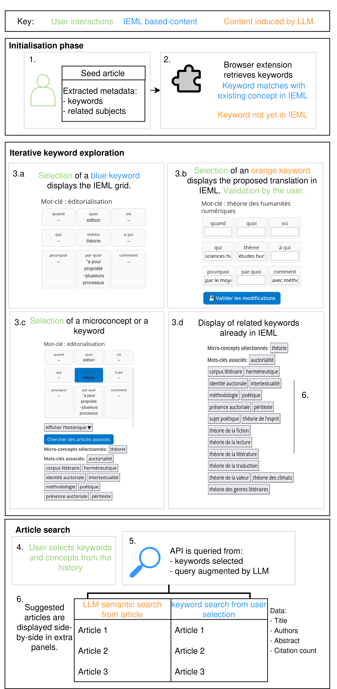
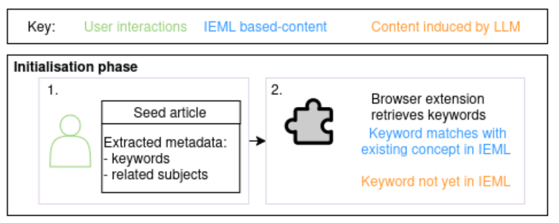
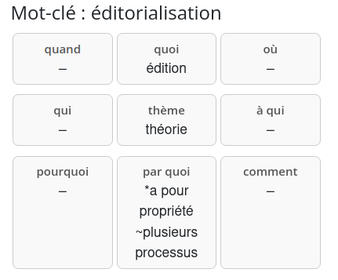

{width=500%}

---



<div style="font-size: 12px;">
Database of translated keywords: Cloudflare bucket
</div>

---


<div style="font-size: 12px;">
- Database of translated keywords: Cloudflare bucket
- Database of dictionnary words (embeddings) : Supabase
- Together AI proxy: Cloudflare worker
</div>

---


<div style="font-size: 12px;">
API handler (Isidore, CrossRef): Cloudflare worker
</div>


# Evaluation

## Examples of expected translation


{width="1500px"}

Note: Translation can only use the IEML dictionnary containing (~3,000 entries). 


---

## Retrieval

Dataset: **50 words translated with 70 dictionnary entries**. 

Evaluation: 1 point for each word in ground truth retrieved. 

strategy|score|
----|--
TF-iDF|15
Cosine similarity|25
Hybrid (TF-iDF + Embeddings)|23

## RAG pipeline

Dataset: 

full: 410 words translated 

- train (examples for fewshot): 50 words
- test (evaluation): 360 words

Models:

- Meta-Llama-3-70B-Instruct-Turbo
- Gemma-3n-E4B-it,
- GPT-oss-20B

---

model/strategy|BLEU|Cosine|avg|
------|-----|----|----|
baseline|0.056|0.515|0.286
llama_fewshot|**0.0222**|**0.555**|**0.289**
gemma_fewshot|0.020|0.491|0.255
openai_fewshot|0.0167|0.498|0.257
llama_zeroshot|0.0129|0.514|0.263
gemma_zeroshot|0.0160|0.479|0.248
openai_zeroshot|0.016|0.493|0.254

Context (i.e. dictionnary entries) only marginally improve performance. 


# Qualitative evaluation

## RAG evaluation

Reminder of the expected translation. 

<div style="font-size: 20px;">
word to translate|theme or root|who|what|to whom|by what means|when|where|why|how
---|---|---|---|---|---|---|---|---|---
**espace numérique**|technique numérique|-|espace|-|-|-|-|-|-|
**chanteur**|jouer ou chanter une mélodie|personne|-|-|*par le moyen de voix|-|-|-|
</div>


----

Examples of LLM-translated content (rag-llama-fewshot)

<div style="font-size: 20px;">
word translated|theme or root|who|what|to whom|by what means|when|where|why|how
---|---|---|---|---|---|---|---|---|---
**espace numérique**|espace|cyberespace|tous|par internet et les réseaux sociaux|-|virtuellement|monétiser et partager des informations
**chanteur**|musique|chanteur|interprétant une chanson|à un public|par sa voix|-|-|pour exprimer une émotion|en utilisant des métadonnées-chanson

</div>

::: {.incremental}

- tends to fill the grid
- do not stick to given dictionnary entries
- do not respect the grammar
:::


## User Study

6 users (PhD students in DH). Demonstration then 10 min of observation then 15 min interview. 

- user-friendliness,
- usefulness,
- keyword navigation,
- translation into IEML, 
- article search and panel comparison.  


## User study results: limits and perspectives

- user-friendliness :
    - confusion about the integration of the concepts into the query
    - automatic translation & validation: initial hurdle (limited database)
    - **direct integration to host search engine**: main improvements (latency, more detailed info on the article, distinction between 'query building' and 'article search' functions)
- usefulness:
    - reveals strong disparities in user research practices (etwork and contextual IR vs. keyword search)
    - strength: comparative panels, 
    - translation of mixed quality encourages **user-agency and dialogical and collaborative work with LLMs**


# Prompts

## Translation prompt


``` 
Tu es un expert en sémantique. Tu dois décomposer sémantiquement le mot-clé "${keyword}" à partir des 9 valeurs suivantes :
'thème, qui, quoi, à qui, par quoi, quand, où, pourquoi, comment'
## Exemples
${examples}

## Mots du dictionnaire 
Tu dois utiliser les mots ci-dessous pour définir le mot-clé "${keyword}":
${context}

Ta réponse prendra la forme d'un CSV à 9 colonnes, les entêtes de colonnes sont: 
'thème, qui, quoi, à qui, par quoi, quand, où, pourquoi, comment'
Il n'est pas nécessaire de remplir tous les champs. Un champs peut rester vide entre deux virgules, comme dans les exemples. 
Répond uniquement avec une ligne CSV finale, sans explication.
```


## Query augmentation prompt

```
Produit 10 variants de la requête booléenne suivante "${keywords}". Combine les requêtes proposées à l'aide de l'opérateur OU comme dans l'exemple : Mots-clés:  "impact of climate change on biodiversity". Réponse: "
(climate change biodiversity impact) OU (effects of climate change on ecosystems) OU (biodiversity loss due to climate change) OU (climate change species extinction) OU (impact of global warming on wildlife) OU (effects of climate change on ecosystems and species diversity) OU (how climate change impacts wildlife and biodiversity) OR (climate change consequences for biological diversity) OU (relationship between climate change and loss of biodiversity) OU (climate change threats to flora and fauna diversity) OU (impact of climate change on biodiversity)
C'est à ton tour avec "${keywords}". Répond uniquement avec la requête sans donner d'explication.
```
---

<!-- ## Backup demo video -->


# Screenshots

---


---


---


---


---


---


<!-- FINAL PROJECT PRESENTATIONS (AI Shark Tank)
Final project presentation guidelines (subject to change):
Each team has 10 minutes. Presentation should follow a pitch+light tech details format:
* Pitch us with your "big idea." Imagine you are pitching this product to an investor or startup accelerator. 
* Demo the tool (5 min). Your demo should walk us through a "real" use case (of a hypothetical "real" user) and showcase all of your tool's functionalities (or nearly all). 
    * Tell us a story and set the stage. When I say "real user" you might even name them, e.g., "Imagine Susie is an accountant who has a problem…" 
* Then, for 4 minutes, go behind the curtains and reveal "how it works"
    * You must show a flow diagram of your LLM-integrated system architecture showcasing especially the points where data is sent to LLMs. You might fit this diagram onto a single slide and talk over it (i.e., no bullet-points)
    * The easiest way to explain the diagram in limited time is to walk us through it using the same example from your demo
    * Gesture to how you verified the prompt/model/etc choice at each step of your pipeline. What tools did you use? Did you create mini-benchmarks of expected behavior to verify prompt/model choices? 
We will have about 2 minutes for questions. We will start at the top of the hour, so everyone must arrive on-time. If the class goes long and another class is waiting, we will find an alternative unused room. -->

