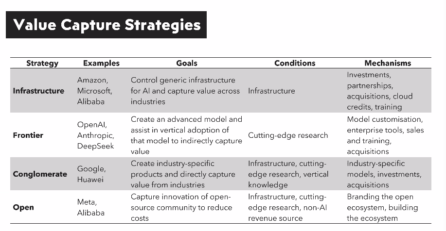

## Uniformisation 

- Des approches
- Des pratiques
- Du discours (création et contrôle des besoins)

Répondre par: 

- Valoriser l'agentivité des étudiant.e.s et des enseignant.e.s, 
- Identifier ses besoins et attentes pour choisir son outil, 
- Favoriser une pluralité d'approches.

Exemples: 

- correction ortho-typographique : le dictionnaire ? 
- littératie numérique 

## Concentration économique et politique 

- Destruction de la planète, 
- Souveraineté digitale : Concentration dans les _clouds_[@rikapCapitalismPowerInnovation2021]

---

 

[@srnicekSiliconEmpiresFight2026]

---

Répondre par: 

- Sensibiliser auprès de l'université : enjeux d'infrastructure
- Alternatives open-sources et low-tech si possible

Exemples:

- MS. Word -> LibreOffice, Stylo, markdown
- Mac/Windows -> Linux

## Biais algorithmiques

- Tous les algo ont des biais : ex : https://laurenleek.substack.com/p/how-google-maps-quietly-allocates?r=2mgxo2&utm_campaign=post&utm_medium=web&triedRedirect=true
- Invisibilisation des biais par un effet d'objectivité et d'autorité de la machine

Répondre par: 

- Enseignement de l'étude critique et de l'analyse critique
- Accepter de changer nos critères d'évaluation.

Exemples : 

- Simplifier la lettre de recommendation, les mails etc. 
- Valoriser l'erreur et le dysfonctionnel [@vitali-rosatiElogeBug2024]

## Bibliographie

