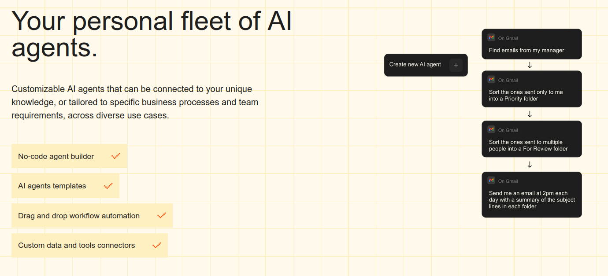
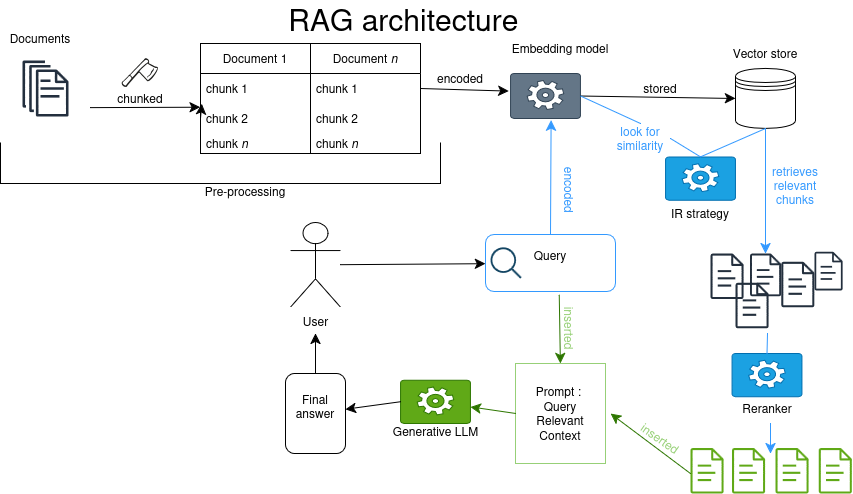

## Présentation


[https://revue30.org/evenements/atelier-automatisation-complexe-revues/](https://revue30.org/evenements/atelier-automatisation-complexe-revues/)
Présentation : 30 min 
Discussion :  45min

Lieu: à distance [https://bbb.futuretic.fr/rooms/up9-kkg-eld-jjl/join](https://bbb.futuretic.fr/rooms/up9-kkg-eld-jjl/join)
Jour et heure : Jeudi : 9h-10h15 (Montréal) / 15h-16h15 (Paris)
Un atelier par mois de février à mai. Suivre la newsletter pour le détail du calendrier.

Objectifs de la série d'atelier: 

- Comprendre plus en profondeur les systèmes d'IA 
- S'outiller concrètement à l'évaluation qualitative (et quantitative) des outils et algorithmes 

### Calendrier: 

12 février : Introduction aux architectures de systèmes complexes intégrant de l'"IA" - Alexia Schneider

19 mars : Evaluation of LLMs for the production of an article's abstract (titre à confirmer) - Gauransh Kumar NB changement d'heure : 9h-10h15 (Montréal) (14h-15h15 heure de Paris)

16 avril : Mythes de l'automatisation, exemple de la HTR (titre à confirmer) - Alix Chagué

Mai : TBA 

# Des systèmes d'IA complexes

## Quelle complexité ?

IA, dite générative ou d'automatisation de la prédiction de token, effectue aujourd'hui des tâches complexes à deux niveaux: 

- **interprétation** d'une instruction donnée en langue naturelle (avec son lot d'ambiguïté).
- **intégration** de LLM dans des process ou pipelines qui impliquent des interactions en chaînes pour traiter une demande : 

    - Systèmes agentiques "_agentic AI_"
    - RAG


## Applications de chat actuelles

ChatGPT, Le Chat de Mistral etc. sont des applications qui interagissent avec un LLM (GPT5.2, Mistral). Ce qui est envoyé comme requête est appelé un prompt. Le prompt ne contient pas que la requête de l'utilisateur. 

Dans ce prompt, on trouve un ensemble d'instructions préliminaires (le _system prompt_) et d'informations complémentaires comme l'historique des échanges (_chat history_). 

Depuis décembre 2024, le Model Context Protocol (MCP) permet l'**intégration modulaire de l'interface de chat à d'autres fonctionalités** des applications grands publics de chat -> interaction avec un agenda sur le cloud, des sites marchands etc.

![Le MCP[^mcp]](img/mcp.png)


[^mcp]: source: https://modelcontextprotocol.io/docs/getting-started/intro -->


## Les agents IA

Renvoie à la notion d'**autonomie**, d'agentivité : narratif promethéen promut par les entreprises de la tech.  

En réalité : Un agent est un enchaîntement d'appels à un LLM. 

L'agent est ce qui permet d'**intégrer à un prompt des informations complémentaires de manière asynchrone**. Informations que le LLM aura solicitées après analyse de la demande entrées par l'utilisateur.ice. 

Autrement dit, **un agent est une "IA" qui se répond à elle-même.** 


## Définition hypée des IA agentiques

![Description des IA agentiques par Docker [@irwinGenAIVsAgentic2025]](img/genai_v_agenticai.png)

---


L'agent a pour objectif de compléter une tâche de manière "autonome" c'est-à-dire sans intervention d'un humain, sans relance de l'utilisateur ou du dev. On parlera de système agentique quand plusieurs agents interagissent. 





Il existe plusieurs architectures permettant de spécialiser des agents : orchestration par un LLM, architecture séquentielle ou parallèle, design en boucle etc.

## Schéma de l'architecture d'un agent IA


# Exemple 

---

Analyse de la demande utilisateur, étape 1 : 

partie du prompt|contenu|
----|-------|
Prompt system : orientation globale | "Tu es un gentil assistant, tu réponds toujours poliment. Analyse la requête de l'utilisateur. 
Prompt sytem : Description des outils| Tu disposes des outils suivants pour améliorer la qualité de tes réponses: Outil 1 : recherche sur internet. Outil 2 : calculatrice addition, Outil 3 : calculatrice soustraction. 
Prompt system: Orientation du formattage de la réponse | Tu répondras toujours avec tes pensées dans la balise `<pensée>` et chaque outil dans une balise `<outil>`. Ta réponse finale sera dans une balise `<reponse>`"
Prompt utilisateur| "Qui a remporté les dernières élections présidentielles ?"

---

Réponse du LLM à l'étape 1: 

>`<pensée>`L'utilisateur veut savoir le résultat des dernières élections. L'utilisateur est localisé en France. Je vais lancer une recherche sur internet.`</pensée><Outil>`recherche sur internet : "élection présidentielle France"`</outil>`

--- 

Parsing de la réponse : extraction du contenu de la balise `<outil>` : lancement de la fonction de recherche d'information avec la requête spécifiée. 

```
rechercheInternet(requete) : 

  return google(requete)
``` 

>Information 1 :  "1. journal1.html 'Macron élu ...' Information 2 :  journal2.html 'Macron est réélu en ce jour de mai...' etc. 
---


Intégration des informations au prompt, étape 2: 

partie du prompt|contenu|
----|-------|
Prompt system : orientation globale | "Tu es un gentil assistant, tu réponds toujours poliment. Analyse la requête de l'utilisateur. 
Prompt sytem : Description des outils| Tu disposes des outils suivants pour améliorer la qualité de tes réponses: Outil 1 : recherche sur internet. Outil 2 : calculatrice addition. Outil 3 : calculatrice soustraction. 
Prompt system: Orientation du formattage de la réponse | Tu répondras toujours avec tes pensées dans la balise `<pensée>` et chaque outil dans une balise `<outil>`. Ta réponse finale sera dans une balise `<reponse>`"
Prompt utilisateur| "Qui a remporté les dernières élections présidentielles ?"
**Retour de la requête**| Information 1 :  "1. journal1.html 'Macron élu ...' Information 2 :  journal2.html 'Macron est réélu en ce jour de mai...' etc. 

---

Réponse du LLM à l'étape 2: 

>`<pensée>`Les sources indiquent que le vainqueur des dernières élections présidentielles est Emmanuel Macron.`</pensée><reponse>`Emmanuel Macron a remporté les dernières élections présidentielles.`</reponse>`

---

Parsing de la réponse : extraction de la réponse finale dans la balise `<reponse>` : transmission de son contenu à l'utilisateur.ice.

>Emmanuel Macron a remporté les dernières élections présidentielles.


---

Du point de vue utilisateur.ice :


"Qui a remporté les dernières élections présidentielles ?" -> Emmanuel Macron a remporté les dernières élections présidentielles.


- Masquage du traitement de la demande : enchaînement silencieux, multiplication des couches interprétatives.
- Repose sur des fonctions de parsing ou déchiffrage : on peut inciter un LLM à générer dans un format structuré, mais les réponses restent probabilistes et non déterministes -> les balises ne sont pas respectées, le modèle 'hallucine' des outils qui n'existent pas, etc.


#  RAG : Retrieval Augmented Generation

Limites du LLM: 

- représentation figée sur les données d'entraînement (= mémoire implicite ne peut pas être mise à jour)
- fenêtre contextuelle limitée (ajd jusque 120 000 tokens, en réalité déclin après ~30 000 tokens) 

-> **perte de fiabilité**

Le RAG : architecture de système d'IA qui repose sur une base de connaissance externe dans le but d'améliorer les réponses d'une IA générative sans demander d'entrainement supplémentaire (_fine tuning_).[@lewisRetrievalAugmentedGenerationKnowledgeIntensive2021] (Facebook, University College London, New York University)

---



## RAG en bref

Requête d'une base de données[^note] avec des méthodes de Recherche d'Information (TF-iDF ou similarité cosinus) + intégration des morceaux extraits au prompt. Le LLM effectue une synthèse. 

[^note]: ou d'un moteur de recherche

## Points d'attention sur le RAG

- Jeux de données externes peut aussi être biaisé,
- Ajout de couches d'interprétation,
- Dissémination de l'information quand l'information se trouve dans plusieurs chunks,
- Angles morts quand l'information importante est dans un chunk non extrait.

# Discussion


## Prochains rendez-vous

19 mars : Evaluation of LLMs for the production of an article's abstract (titre à confirmer) - Gauransh Kumar NB changement d'heure : 9h-10h15 (Montréal) (14h-15h15 heure de Paris)

16 avril : Mythes de l'automatisation, exemple de la HTR (titre à confirmer) - Alix Chagué

mai : TBA

## Bibliographie