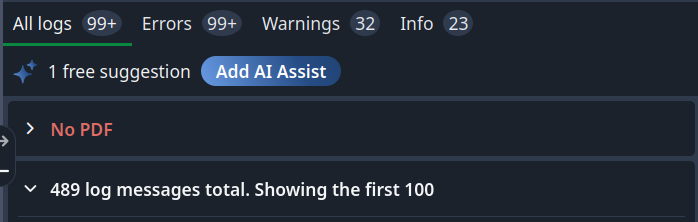

## LaTeX C'EST BIEN


## LaTeX C'EST EXPLICITE

```

\subsection{Research Questions}

\begin{itemize}
    \item {\textit{RQ1}}: What kind of alternative to AI research assistant can be designed that can put forward unexpected connections in an explainable and transparent way for the user?

    \item {\textit{RQ2}}: What can a direct comparison between a symbolic ontology and an LLM-based semantic retrieval reveal about their underlying epistemic models? 
\end{itemize}

\subsection{Contributions}

```


## LaTeX C'EST ... BIEN

- 448 lignes de `.tex` + 3633 lignes de `.cls` 
    - 4 pages `.pdf`

---

- Tu utilises un template ? 

- 

## ???

- 

- 

---

- Compile : décollage imminent 

- Compile time 


# TU VEUX ECRIRE TA THESE EN LaTeX ?

# BON CHONCE

# INTRODUCING YOUR NEXT AI POWERED ASSSISTANT

---

ahah

---

- Tu comprends Markdown ?
- Tu sais coder vite fait ?
- Tu aimes le WYSIWYM 
    - mais tu aimes pas attendre 20 min pour voir le rendu de 2 lignes de texte ?
    - tu veux écrire ta thèse et pas un index des pages stackExchange utiles pour formatter un tableau ? 

## INTRODUCING TYPST

- reliable
- fast 
- intuitive

## WHAT IS TYPST

Laurenz Mädje + Martin Haug développent Typst as a side project en 2023. 

Un compilateur open-source et une application propriétaire en ligne, comme Overleaf pour LaTeX.

## WHAT _IS_ TYPST

Rust. 

Syntaxe = Markdown pour la structure + du code précédé par `#`. 


# Demo time

# MRCI


