## Introduction

<!-- abstract ;

La multiplication de "AI-powered research assistant" fait intervenir à tous les niveaux de la recherche d'information (RI) des algorithmes dits d'"IA", sans préciser bien souvent la place et la teneur des processus d'automatisation en jeux. En plus de renouveller les interrogations autour des filtres interprétatifs et critères de pertinences appliqués aux requêtes utilisateur, ces nouveaux outils ou nouvelles fonctionnalités orientent nos pratiques et ont le potentiel de transformer notre rapport à la découvrabilité et à l'innovation qu'elle sous-tend. Cette communication propose de cerner ces changements en cours, notamment ceux qui engagent une redéfinition paradigmatique de la sérendipité dans les pratiques de RI en contexte académique. 

si ces assistants nous promettent un équilibre entre trouvabilité et sérendipité, la difficile reproductibilité et le manque de transparence de certaines de ces architectures de recherche dite sémantique, renouvelle les interrogations sur la place du filtre qu'elles invisibilisent à travers des critères de pertinence et des méthodes de _ranking_ 

opérés par les algorithmes de RI.  
Si ces algorithmes permettent de personnaliser le contenus, on peut se demander s'ils ne provoquent pas des "bulles de filtre" comme les nomme Eli Pariser, et s'ils se basent sur des métriques de citation, alors on peut se demander s'ils ne favorisent pas la concentration de citation aux mains d'un nombre réduit. 
Derrière la question du simple accès à l'information, se pose celle de l'invisibilisation de certains points de vue et de l'impact qu'on ne peut mesurer des méthodes de valorisation de certaines publications. 
 -->

**Cette communication présente la plus-value de la sérendipité comme alternative épistémique et fait état de propositions pour valoriser l'agentivité humaine dans les outils et fonctionnalités dites d'IA en contexte de recherche documentaire.**

Contributions : 

- Description de l'influence possible de fonctionalités d'automatisation de tâches sémantiques dans l'écosystème de la production et diffusion de contenu savant. 
- Contribution théorique : la sérendipité comme support à l'agentivité humaine et  alternative épistémologique aux paradigmes dominants de RI.
- Propositions techniques concrètes de valorisation de l'agentivité humaine. 

## Plan 

1. Les assistants IA et la recherche documentaire  
2. La sérendipité comme alternative épistémologique au régime de découvrabilité matérialisé par les outils d'IA actuels.
3. Propositions pour le développements d'outils valorisant l'agentivité humaine.

<!-- intervention épistémologique, pas de méthodologie, pas de résultats -->

# Les assistants IA et la recherche documentaire  

## "Intelligence artificielle" et Recherche d'Information

IA : "automatisation de la cognition" @abbassEditorialWhatArtificial2021

Recherche d'Information : mise en correspondance d'une requête avec un ou plusieurs documents. 

Contexte : le sujet traverse toute la diffusion de la recherche à toutes les étapes: de l'écriture/édition à la diffusion et enfin la construction de requêtes. 

--- 

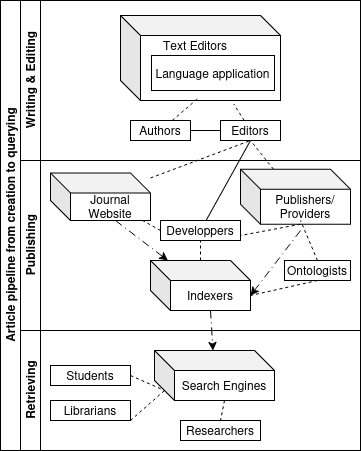

## Typologie des interventions possibles de l'IA dans la recherche documentaire

1. Création de métadonnées : Désambiguisation, création de mots-clés, classification de sujets, produition d'abstract. Ex: Isidore -> _machine learning_ pour attribution de sujets reliés. 
2. Expansion de requête : Thésaurus, ontologie vs. _query expansion_
3. Méthode de recherche d'information : recherche lexicale (booléen, regex, TFiDF, BM25) vs. recherche dite sémantique (comparaison de vecteurs). 
4. Classement/ranking  
5. Enrichissement de la liste de résultats 
6. Synthèse et analyse des sources : RAG, _deep search_

Typologie en partie proposée par @tayWhatWeActually2025.

<!-- ## Reranking

Classement des articles présentés selon un critère de pertinence par rapport à la requête. 

1. _Machine learning_ classique (entraînement d'un modèle au classement).

2. Comparaison de vecteurs (requête/titre de l'article): score = proximité. ex: Primo search assistant[^primo]

3. Évaluation par un LLM type 'gen AI' : prompt de classement ou catégorisation de pertinence. Fournissent les explications: Ex: Asta

4. Ajout de critères externes Ex: SemanticScholar, "highly-cited papers"

[^primo]: Source: https://knowledge.exlibrisgroup.com/Primo/Product_Documentation/020Primo_VE/Primo_VE_(English)/015_Getting_Started_with_Primo_Research_Assistant
 -->

---

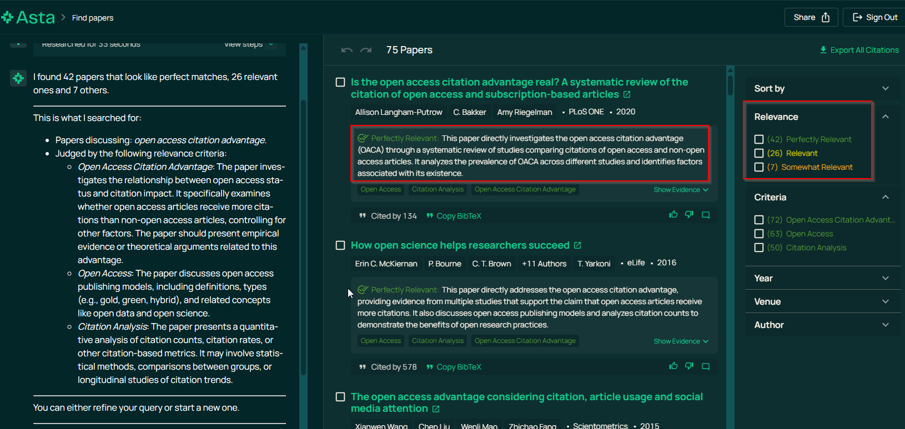
<!-- 
## Enrichissement de la liste de résultats -->
--- 

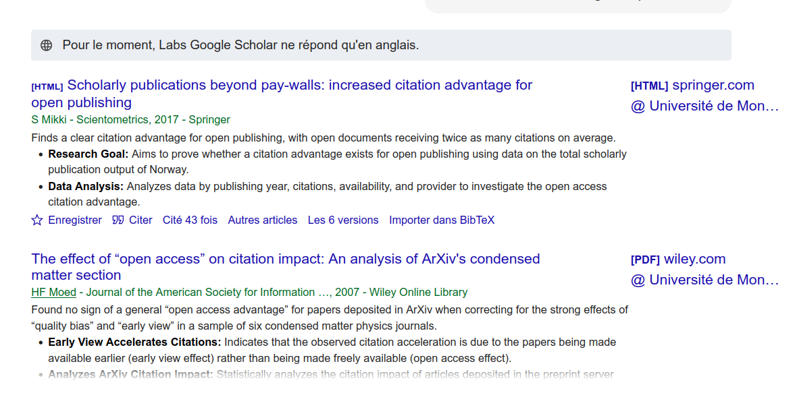

<!-- ## Synthèse des articles ou assistant de revue de littérature

Synthèse des articles extraits pour répondre à une question en langue naturelle => RAG. 

1. RAG simple: Elicit,  SciSpace (source: Semantic Scolar, Open Alex), fonction TLDR de Semantic Scholar. 

2. _Deep research_ : Agentic AI, spécialisation de plusieurs agents, retourne un rapport complet en quelques minutes. Fonctionalités spécialisés Ex: Consensus fonctionalité "Study Snapchot".   -->

--- 

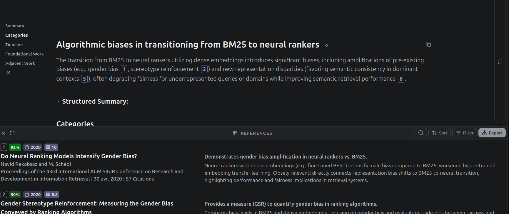

[source](https://app.undermind.ai/report/96d1ce264f5b976eac434514d16e2529a99968d6928b225d57859617b14beca1)

## Limites des outils de synthèse

- Quelles bases de données ?
- Basé sur métadonnées seulement (abstract) ?
- Peut inventer des sources pour répondre à une question (-> _citogenesis_ phénomène qui précède les LLM et les _lit review assistants_.)

> The AI-generated things get propagated into other real things, so students see them cited in real things and assume they’re real, and get confused as to why they lose points for using fake sources when other real sources use them [@kleeAIInventingAcademic2025]

## L'oracle 

- effet boîte noire
- "blank box"[@tayBlankBoxProblem2026]
- la pensée magique du "sparkle" et le discours utilitariste.

# La sérendipité comme alternative épistémologique

## La modélisation sémantique basée sur l'hypothèse distributionnelle 

Hypothèse distributionnelle de @harrisDistributionalStructure1981. 

> You shall know a word by the company it keeps. 
> --- @firthStudiesLinguisticAnalysis1962

vs. 

> Colorless green ideas sleep furiously
> --- @chomskySyntacticStructures1957

Dans le cadre d'une recherche d'information : **faut-il chercher seulement ce qui est le plus probable ?**

**Conséquence : cristallistion d'un modèle sémantique induit depuis une probabilité basée sur une fréquence d'occurrence dès la requête effectuée** et plus seulement pour la recherche d'articles pertinents. 

La manière de requêter un moteur de recherche va déterminer les informations auxquelles nous avons accès et sur lesquelles nous basons nos recherches.   

## Découvrabilité 

L'innovation et la recherche dépendent fortement de notre capacité à effectuer de nouveaux liens sémantiques.

Deux faces : 

- trouvabilité : accéder à l'information que l'on cherche (côté de l'indexation documentaire)
- sérendipité : accéder de manière fortuite à ce qu'on ne sait pas ne pas savoir (côté utilisateur)

Beaucoup étudié dans le contexte du e-commerce et la diffusion de contenus culturels sinon par les sciences de l'information et de la documentation pour la découvrabilité en science.  

## Sérendipité et créativité

'browsing' est un processus a 4 dimensions [@riceResultsMotivatingThemes2001] : 

1. the act of scanning;
2. the presence or absence of purpose;
3. the specificity of search outcomes or goals; 
4. and knowledge about the resource and object sought.

La sérendipité est le processus et le résultat de ce '_chance encounter_' -> créativité de la connexion. 

![Modélisation de la sérendipité [@makriComingInformationSerendipitously2012]](img/modelSerendipityMakri.png)

Importance de la **dimension réflexive**  pour distinguer la sérendipité du hasard.

## Sérendipité, créativité et LLM

> The work of any creative system can be viewed as a process of search through a space of possibilities or a ‘possibility space’” 
> --- @perkinsInsightMindsGenes1994 cité par @bjornebornAdjacentPossible2022 

Espace latent : espace des possibles selon les contraintes définies par la développeuse de l'algorithme, contient tout ce qu'est capable de prédire un algorithme. 

## Place de la sérendipité dans la science

Les approches exploratoires et sérendipitaires en recherche documentaire :

- "adjacent possible" [@kauffmanInvestigations1996; @bjornebornAdjacentPossible2022] : contraintes environnementales donne lieu à une négociation entre exploitation et exploration [@monechiWavesNoveltiesExpansion2017]

- exploitent la profusion pour générer des connexions inattendues [@batesDesignBrowsingBerrypicking1989; @erdelezInformationEncounteringIts1999]

- favorisent le décloisonement disciplinaire [@dumasprimbaultNaviguerDansSavoirs2023] 

<!-- Dumas Primbault : importance des disciplines pivots -->

## La sérendipité et le numérique 

L'exploration au coeur de l'expérience du numérique connecté : 

>la force politique d’Internet (1969-2009) réside dans la prééminence donnée à une catégorie particulière d’activité : l’exploration. Internet s’est fondamentalement constitué sur le réaménagement de l’action autour de l’exploration : il a donné la prééminence à l’expérimentation sur l’intériorisation, aux tâtonnements incertains sur les apprentissages formels, au jeu et au défi sur l’examen scolaire. Il a structuré des communautés sceptiques, ouvertes et curieuses.
> --- [@aurayTechnologiesLinformationRegime2011]

vs. l'émergence de logiques algorithmiques limitantes : 

> While it was felt that some element of control could be exercised to attract “chance encounters”, there was a perception that such encounters may really be manifestations of the hidden, but logical, influences of information gatekeepers – inherent in, for example, library classification schemes 
> --- [@fosterSerendipityInformationSeeking2003]

## Défis de la sérendipité

Reproductibilité : comment garder trace d'un parcours exploratoire? On garde en mémoire un nombre limité d'étapes qui mènent à une résolution  [@erdelezInvestigationInformationEncountering2004]. 

Évaluation : comment évaluer l'impact d'une trouvaille ? Et l'intérêt d'une nouvelle fonctionnalité de recherche [@pouyllauUtiliserIsidorescienceRegard2023; @pouyllauDurabiliteRefactorisationInstruments2025] ?

Design : de quelle manière peut-on créer des points d'affordance qui permettent aux utilisateur.ices de _trouver du sens_ ?

## Questions de recherche 

Comment concevoir des systèmes explicables qui :

- Se trouvent au centre d'environnement favorisent la sérendipité et l’exploration critique ?

- Permettent une interaction réflexive avec l'algorithme ?

# Propositions 

## Laisser place à l'incertitude

Un changement paradigmatique. 

Le paradigme des Humanités Numériques : 

> « Can we conceive of models of interface that are genuine instruments for research? That are not merely queries within pre-set data that search and sort according to an immutable agenda? How can we imagine an interface that allows content modeling, intellectual argument, rhetorical engagement? » 
> --- [@druckerPerformativeMaterialityTheoretical2013]

Contrefactualisation :  [@chevillonAlgorithmesQueersPerturber2026] cerner quelle variable explicative changer à l'algo pour obtenir un autre résultat : expliciter les possibles alternatifs. 

Et le _delight_ dans l'expérience utilisateur. [@rodwellUserExperienceUX2025] 
<!-- 
Ex : le _Provotype_ [@boerProvotypesParticipatoryInnovation2012] -->

=> Faire apparaitre les incertitudes et les limites des outils. 

## Désordonner  

Ex: [françaiS au pluriel](https://www.enfrancaisaupluriel.fr/library?mode=tree)  [@suchetFrancaiSAuPluriel2026]

---

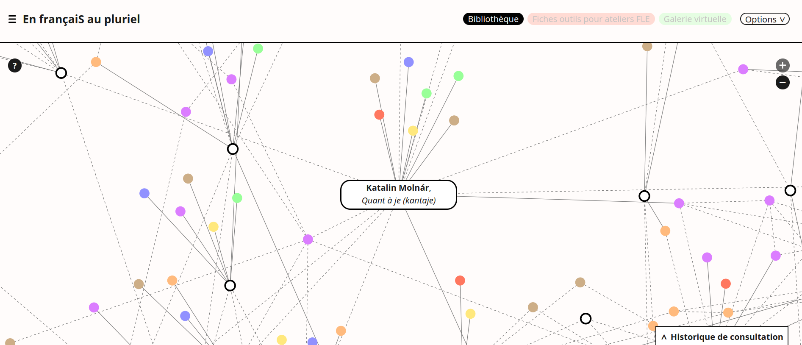

--- 

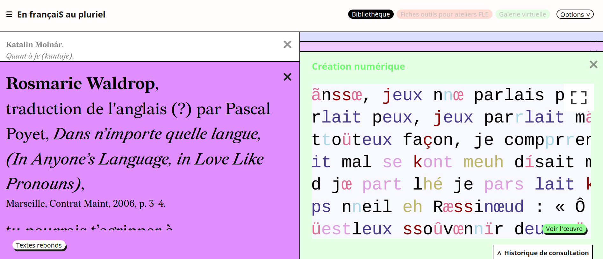

---

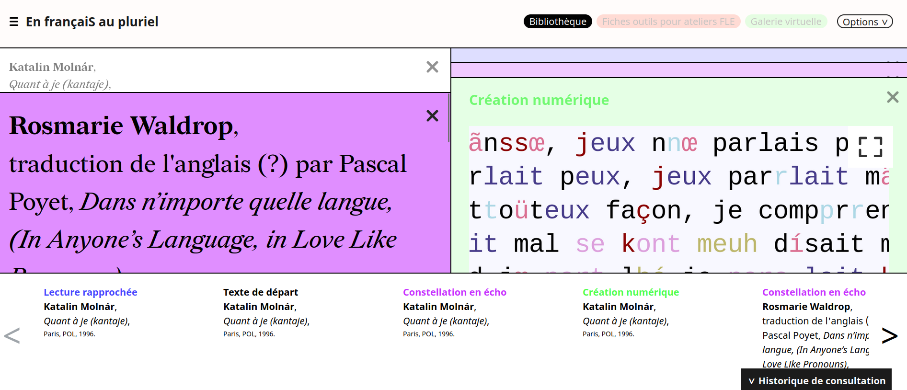

## Explorer d'autres facettes

Mettre en valeur des facettes sémantiques sous-explorées pour offrir d'autres parcours. 

Ex: typologie du type de citation -> réseau citationnel au-delà de la quantification

---

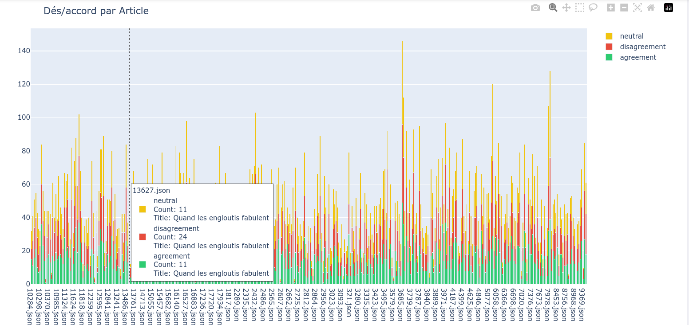

---

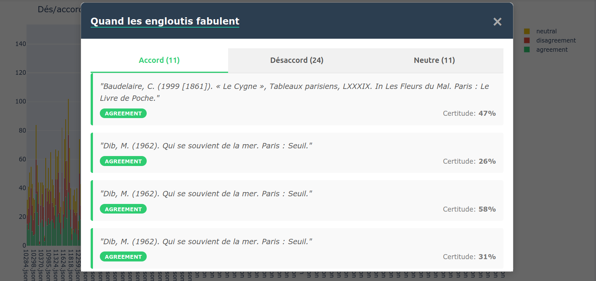

## Restitution comme appui à l'expertise 

- Rapports complets retraçant la médiation algorithmique de la demande utilisateur.ice à la réponse ou à la liste d'articles en retour (critères du reranking, prompt de reformulation de la requête etc. ). 

- Exposer les limites et capacités de l'outil Ex : Barista, l'assistant de constructeur de requête sur Impresso  

---

## Spécialisation de la classification et de la quantification 

La classification spécialisée assiste le jugement humain :

Ex: Evidence-RAG du _Journal of Digital History_ : assiste l'éditeur dans la restitution de l'évaluation d'un article : situe la pertinence d'un commentaire par rapport à l'article évalué.

Ex : Le dés/accord de citation dans un réseau citationnel 

## Exaptation et imperfection

(théorie de l'évolution): "adaptation sélective opportuniste, privilégiant des caractères qui sont utiles à une nouvelle fonction, pour laquelle ils n'avaient pas été initialement sélectionnés."

Ex: "Détournement" de la recherche de moteurs de recherche réputé défaillant de Gallica [@dumasprimbaultDecouvrabiliteCommePrise2025]

## Friction 

Réseaux antagoniste génératif (_generative adversarial networks, GANs_) [@goodfellowGenerativeAdversarialNetworks2014] et IA antagoniste [@caiAntagonisticAI2024]. 

Esprit de contradiction : permettre la correction et l'évaluation par l'utilisateur.ice. :  [@schneiderImperfectAIUphold2026] à venir INKE

Ex : IEML-RS [@schneiderReclaimingEpistemicAgency2026]

---

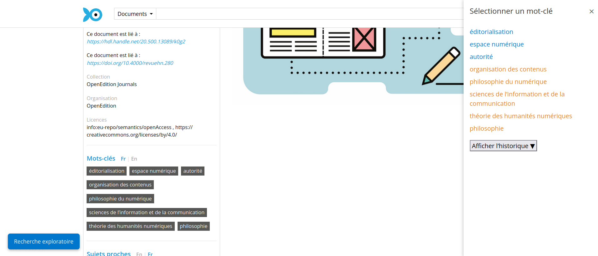

---

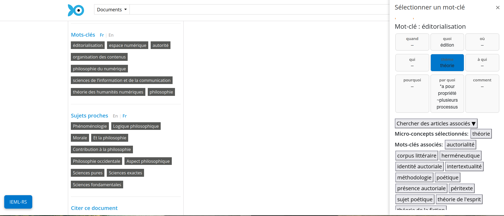

---

<!-- 
 (idée de Pierre Lévy : permettre la correction de la traduction automatique en IEML générée par Gemini). -->

## Résumé des propositions

- Laisser place à l'incertitude
- Désordonner 
- Explorer d'autres facettes 
- Restitution comme appui à l'expertise
- Spécialisation de la classification et la quantification
- Exaptation 
- Friction

# Conclusion

La sérendipité comme processus de sélection réflexif face à une masse documentaire peut-être un vecteur de créativité probant pour matérialiser l'agentivité humaine. 

Développer des outils qui explicitent les choix effectués, et laisse la place à un **bruit transparent** plutôt que de laisser une interface sans aspérité peut mettre en avant l'agentivité humaine. 

## Remerciements 

Ces travaux ont bénéficié d’un octroi grâce au financement du Consulat général de France à Québec et du Fonds de recherche du Québec qui a permis un séjour de recherche au sein du Huma-Num Lab par la bourse de mobilité Sophie Germain. 

  <!--(« #DOSSIER » ou https://doi.org/10. 10.#####/#####) quand j'aurais le DOI  -->

Recherche financée par le CRSH à travers le projet de partenariat Revue3.0 ainsi qu'une bourse du Réseau Circé de mutualisation et de recherche pour les revues scientifiques. 

## Bibliographie