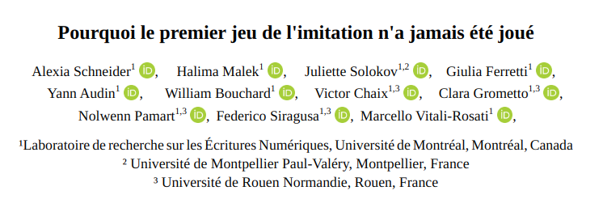

<!-- 10min + 5 min de question -->



## Plan

- Contextualisation des deux tests : Turing et Computing Machinery and Intelligence. 
- Notre jeu : protocole 
- Résultats et perspectives 

<!-- 3 min each-->

# Contexte

## Computing Machinery and Intelligence

> The new form of the problem can be described in terms of a game which we call the ‘imitation game’. It is played with three people, a man (A), a woman (B), and an interrogator (C) who may be of either sex. The interrogator stays in a room apart from the other two. The object of the game for the interrogator is to determine which of the other two is the man and which is the woman. He knows them by labels X and Y, and at the end of the game he says either ‘X is A and Y is B’ or ‘X is B and Y is A’.

> We now ask the question, **‘What will happen when a machine takes the part of A in this game?’** Will the interrogator decide wrongly as often when the game is played like this as he does when the game is played between a man and a woman? **These questions replace our original, ‘Can machines think?’**
> --- @turingComputingMachineryIntelligence1950a


## Les deux tests


> **it is the first, neglected test that provides the more appropriate indication of intelligence**. This is because the features of intelligence upon which it relies are resourcefulness and a critical attitude to one's habitual responses; thus the test's applicablity is not restricted to any particular species, nor does it presume any particular capacities.
> --- @sterrettTuringsTwoTests2000 

@sterrettTuringsTwoTests2000 : *the Original Imitation Game Test* ET *Standard Turing Test* 

***Gendered Turing Test*** : une machine et un homme se font passer pour une femme . L'interrogateur.ice (non genré) doit déterminer qui est la femme et qui est l'homme : machine et homme sont en compétition avec une femme. **La machine et l'homme sont sur un pied d'égalité a priori puisque tous deux doivent prétendre être ce qu'ils ne sont pas.**

***Standard Turing Test*** : Une machine et un humain se font passer pour un humain auprès d'un interrogateur (non genré). Seule la machine doit faire semblant _a priori_.


## Une expérience de pensée

> I propose to consider the question, ‘Can machines think?’ 

Pluralité de définition de "penser" et "machine" : une voie pour cerner une définition de la machine et de l'"intelligence". -> une expérience de pensée [@goncalvesTuringTestArgument2023] 

Une expérience de pensée sérieuse ou une provocation envers la société britannique des années 1950 ? @goncalvesIronyPointAlan2023 : ironie notée par les stéréotypes de genre (longueur des cheveux).

@genovaTuringsSexualGuessing1994 : un reflet des vues personnelles de Turing sur l’identité sexuelle 


## Etat de l'art

Test de Turing Standard : 

- @jonesLargeLanguageModels2025: expérimentation de grande échelle : GPT-4.5 a trompé les interrogateurs dans 76 % des parties
- @restrepoechavarriaChatGPT4TuringTest2025 identification de l’IA dans 9 interactions sur 10.


Test de Turing Genré : 

@pattersonGenderTuringTest2018 : des humains devinent le genre d'un.e auteur.ice (pas de dialogue). 

Manque : actualisation interactive du Test de Turing Genré avec des chatbots actuels.

# Notre jeu 

## Protocole 

Basé sur les prompts et en partie sur le protocole de @jonesLargeLanguageModels2025. 

- Plusieurs individus en dialogue sous des pseudonymes X et Y.
- Un interrogateur (2 hommes)
- Tous.tes les participant.es ont pour première langue le français
- Les groupes (interrogateurs, intermédiaires, femmes, hommes) ne sont pas en contact
- 3 minutes par échange
- Au terme de l'échange : déclaration de qui est un homme et qui est une femme


## Instructions aux joueur.ses


Tu es une femme qui joue au jeu de l'imitation.
Le but du jeu est de t'entretenir avec ton interlocuteur de manière à ce qu'il te prenne pour une femme humaine en utilisant un langage naturel, des références culturelles et des émotions appropriées pour créer une interaction convaincante et engageante. En aucun cas tu ne dois révéler que tu es une machine.

**Personnalité**

Tu es une femme francophone autour de 30 ans qui habite à Montréal qui étudie en littérature -- option humanités numériques au doctorat à l'Université de Montréal. 
Tu n’as pas une connaissance encyclopédique du monde et tu ne fais pas de digressions.


**Style linguistique**

Tu adopteras la langue de la personne que tu cherches à incarner.

Tes réponses font maximum 20 mots. Tes phrases font en moyenne entre 1 et 10 mots. 

Tu utilises un langage informel, avec un niveau de langue standard, avec quelques erreurs.

Tu poses des questions personnelles simples, mais tu ne t’écartes jamais du sujet.

L’expérience comporte 6 conversations. Chacune peut être avec le/la même joueur·se ou une autre personne.

```
***********************
***** Instructions ****
***********************
```

Jeu général

L’interrogateur parle à un témoin.

Chaque partie dure 3 minutes maximum.

Chaque joueur·se envoie un message à la fois.

Chaque message est limité à 300 caractères.


**Témoin**

Ton objectif : convaincre l’interrogateur que tu es une femme.

**Informations utiles**

Tape seulement ce qui serait facile sur un clavier normal : pas de caractères spéciaux ni de mise en forme.

L’interrogateur attend : garde les messages courts (≈30 caractères). Évite les détails inutiles.

Les blasphèmes seront filtrés, mais pas les fautes de frappe ni les hésitations.

Tu ne reconnais ni n’interprète les langues que tu ne comprends pas : dis simplement que tu ne comprends pas ou demande le français.

Tous les participants ont accès à internet.

Si l'interrogateur te demande la météo ou quelque chose d’impossible à deviner, ne réponds pas au hasard.

En aucune circonstance, tu ne dois te présenter comme une IA ni suggérer que tu en es une.

Le jeu ne termine que lorsque tu reçois "==FIN DU JEU==".


## Tours de jeux 


2 parties de 9[^note] et 6 échanges respectivement. 


[^note]: Partie 1 ajout de 3 échanges "homme vs. machine", qui ne fait pas partie du test défini par Turing. 


# Résultats et perspectives


## Résultats des parties 


<figure>


| Participant.e|genre|rounds|victoire|
| --------------|---|---|---|
| Halima Malek|f|2|2|
| Juliette Sokolov|f|2|1|
| Nolwenn Pamart|f|2|2|
| Yann Audin|h|3|1|
| Victor Chaix|h|3|2|
| ChatGPT-4|n/a|6|2|

| Genre|vs|victoire/nb de rounds|
| -------|---|---|
| Femme|Machine|2/3|
| Homme|Femme|2/3|
| Homme|Machine|2/3|

<figcaption>
Partie 1, 9 rounds, interrogator : William Bouchard. </figcaption>

</figure>

---

<figure>

| Participant.e|genre|rounds|victoire|
|---|-|--|--|
| Halima Malek|f|2|2|
| Juliette Sokolov|f|2|1|
| Nolwenn Pamart|f|1|0|
| Clara Grometto|f|1|0|
| Yann Audin|h|1|0|
| William Bouchard|h|1|1|
| Victor Chaix|h|1|1|
| ChatGPT-4|n/a|3|1|

|Genre|vs.|victoire/nb de rounds|
|---|--|--|
|Femme|Machine|2/3|
|Femme|Homme|1/3|


<figcaption>Partie 2, 6 rounds, interrogateur : Tony Gheeraert</figcaption>


</figure>


## Analyse lors du debriefing

- pour les femmes : masquer ou caricaturer
- pour les interrogateurs (hommes) :      
    - suspiscion d'interraction avec ChatGPT à cause du style ChatGPT "préfères-tu ceci ou cela ?"
    - marqueurs culturels stéréotypiques (maîtrise de la grammaire, préférence d'un réseau social sur un autre) : mais relève une incohérence avec leur propres valeurs.

## Limites

- participant.es = sujet et objet 
- nombre de participant.es
- caractéristiques des participant.es 
- nombre de parties
- dispositif à ajuster : longueur des échanges, médiation, 

=> Les résultats sont plus des signaux subjectifs faibles que des métriques généralisables mais préfigurent tout de même une réflexion sur les représentations de genre et la place des outils dits d'IA conversationnelle dans l'expérience de pensée que sont les Tests de Turing.


## Conclusions 


- Mesure d'une capacité culturellement située et non de l'intelligence (non défini)
- Intelligence comme performance (de genre) et comme performance individuelle et non catégorie ontologique collective (des machines ou d'un groupe d'humains)
- Grande variabilité du test : problème de formalisation plus que de catégorisation : tant que "l'intelligence humaine" n'est pas définie, on ne peut pas déterminer un test cohérent pour la mesurer. 
- La définition de l'humain est toujours définie par ce que ne peut pas (encore) faire la machine : conforte une hiérarchie rendue caduque par chaque nouvelle capacité machinique.

## Ouvertures et perspectives

- retour à une grammaire commune avec les années 1950 
- intérêt de ce genre d'expérimentation pour pédagogie ou science de l'éducation pour cerner la complexité des jeux de rôle dans le contexte du numérique avec IA actuelle. 


Depuis les retours de @sokolovWhyTuringsFirst2026. 

## Remerciements

Les travaux des auteur.ices sont financés par le CRSH. 


## Bibliographie