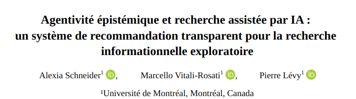
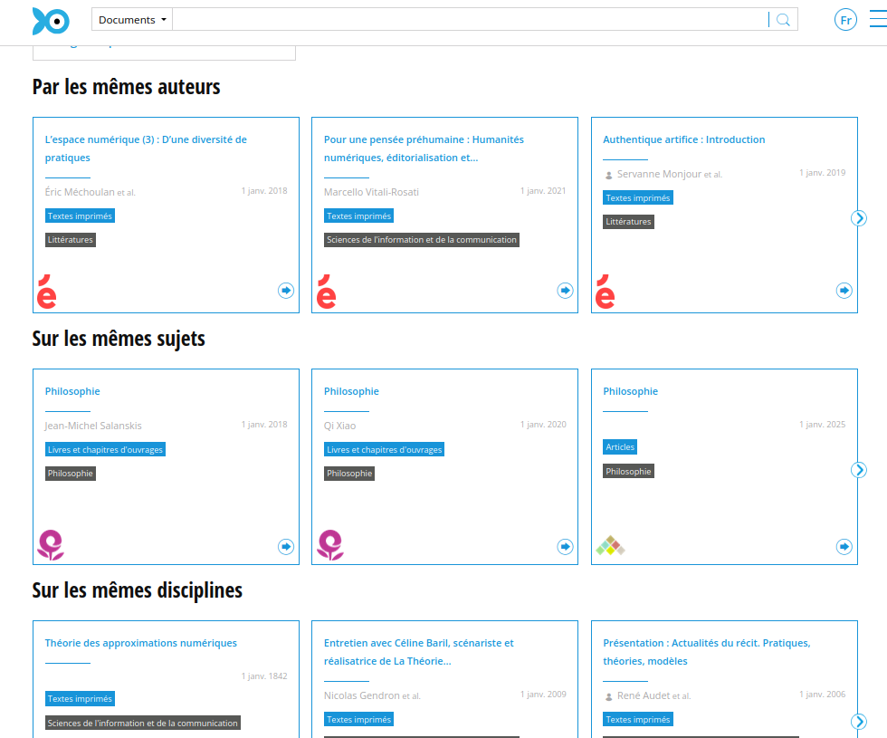
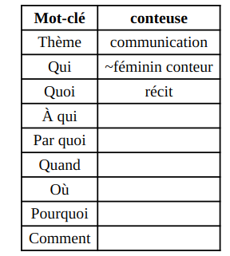
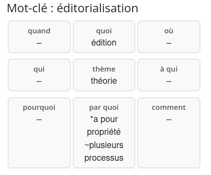
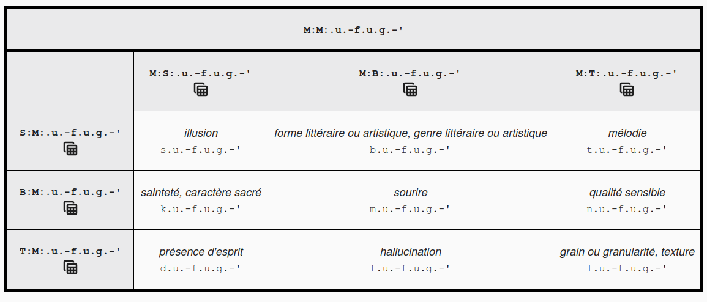
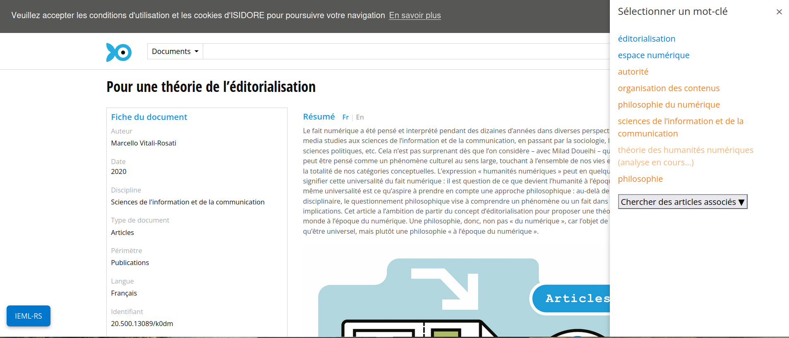
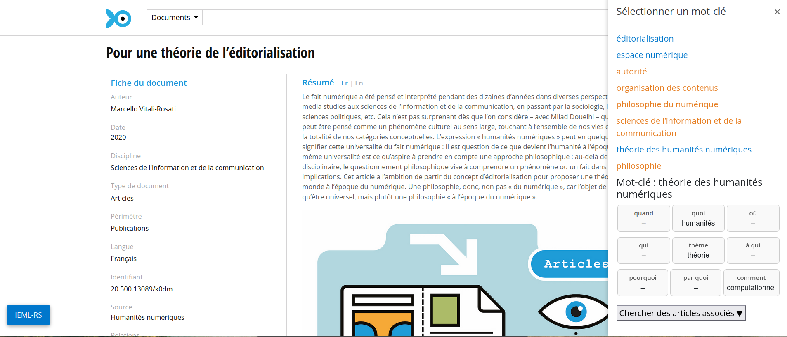
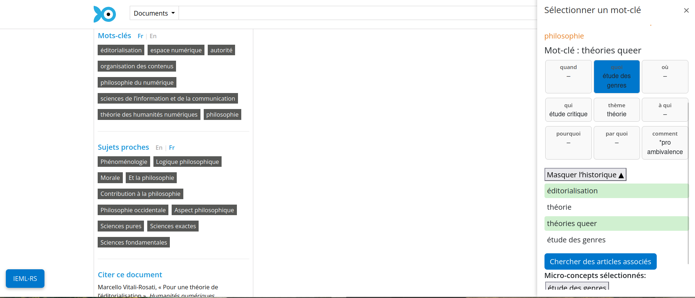

## Plan

- Introduction 
- Problèmatique 
- Etat de l'art (bref)
- Demonstration
- Evaluations des fonctionalités d'IEML-RS
- Conclusion

<!-- 5 min par partie + 1 min conclusion -->
<!-- 20 min + 10 QA-->


## Introduction 

Systèmes de recommandation ont changé de forme : 

d'algorithmes qui extraient des "you might also like" en bordure de moteurs de recherche à des outils qui prennent en charge une requête en langue naturelle. 

---



---


## Problématique

- concentration de citations (effet Matthew [@mertonMatthewEffectScience1968]), bulles de filtre [@pariserFilterBubbleWhat2011], biais de confirmation [@underwoodTheorizingResearchPractices2014] : réduction de l'espace épistémique de la découverte [@nielsenGlobalCitationInequality2021; @vargaNarrowingLiteratureUse2022]. 
- opacité du ranking, des filtres, de la synthèse s'il y a lieu [@archambaultEvaluationCuttingEdgeAI2024; @pattersonWhichAITools2025; @tayReproducibilityInterpretabilityAcademic2025]

## Questions de recherche 

Comment concevoir des systèmes explicables qui :

- Se trouvent au centre d'environnement qui favorisent  l’exploration critique  et permettent un engagement intellectuel avec l'algorithme ?

## Quelques exemples de systèmes de recommandations alternatifs

- `Bridger` de @portenoyBurstingScientificFilter2022  expose les chercheur·se·s à des auteur·ice·s extérieur·e·s à leurs réseaux intellectuels habituels afin de favoriser le décloisonnement disciplinaire.

- `VITALITY` de @narechaniaVITALITYPromotingSerendipitous2022 propose une approche de revue de littérature fondée sur la visualisation

- `STAK` de @martinSTAKSerendipitousTool2017, s’est inspiré des affordances matérielles des bibliothèques physiques en tentant de recréer des environnements de navigation spatialisés.

## IEML-RS : cadre théorique


Question initiale des travaux avec IEML : Qu’est-ce qu’une comparaison directe entre une ontologie symbolique et une recherche sémantique fondée sur les GML peut révéler sur leurs modèles épistémiques sous-jacents ?


- découvrabilité (trouvabilité et **sérendipité**)

- ancrage de la _Performative Materiality_ des Humanités Numériques telle que définie par @druckerPerformativeMaterialityTheoretical2013 : 

> « Can we conceive of models of interface that are genuine instruments for research? That are not merely queries within pre-set data that search and sort according to an immutable agenda? How can we imagine an interface that allows content modeling, intellectual argument, rhetorical engagement? » 
> --- @druckerPerformativeMaterialityTheoretical2013


## IEML 

Information Economy MetaLanguage (IEML) [@levySemanticComputingIEML2023] 







Dictionnaire de termes traduits en IEML [https://ieml.intlekt.io/](https://ieml.intlekt.io/) 




# Démonstration

## Résumé des fonctionalités principales

- Exploration d'un champs sémantique élargit grâce à IEML à partir d'un mot-clé
- Génération automatique et correction (_human-in-the-loop_) des traductions manquantes
- Construction d'une requête envoyée à Isidore
- Comparaison des listes d'articles envoyé à partir de la requête simple et de la requête augmentée par LLM


# Prompts

## Translation prompt


``` 
Tu es un expert en sémantique. Tu dois décomposer sémantiquement le mot-clé "${keyword}" à partir des 9 valeurs suivantes :
'thème, qui, quoi, à qui, par quoi, quand, où, pourquoi, comment'
## Exemples
${examples}

## Mots du dictionnaire 
Tu dois utiliser les mots ci-dessous pour définir le mot-clé "${keyword}":
${context}

Ta réponse prendra la forme d'un CSV à 9 colonnes, les entêtes de colonnes sont: 
'thème, qui, quoi, à qui, par quoi, quand, où, pourquoi, comment'
Il n'est pas nécessaire de remplir tous les champs. Un champs peut rester vide entre deux virgules, comme dans les exemples. 
Répond uniquement avec une ligne CSV finale, sans explication.
```


## Query augmentation prompt

```
Produit 10 variants de la requête booléenne suivante "${keywords}". Combine les requêtes proposées à l'aide de l'opérateur OU comme dans l'exemple : Mots-clés:  "impact of climate change on biodiversity". Réponse: "
(climate change biodiversity impact) OU (effects of climate change on ecosystems) OU (biodiversity loss due to climate change) OU (climate change species extinction) OU (impact of global warming on wildlife) OU (effects of climate change on ecosystems and species diversity) OU (how climate change impacts wildlife and biodiversity) OR (climate change consequences for biological diversity) OU (relationship between climate change and loss of biodiversity) OU (climate change threats to flora and fauna diversity) OU (impact of climate change on biodiversity)
C'est à ton tour avec "${keywords}". Répond uniquement avec la requête sans donner d'explication.
```


## Évaluations 

- Évaluation quantitative de la traduction produite par le LLM en IEML (RAG pour ancrage des traduction dans les mots du dictionnaire IEML)
- Évaluation quallitative (user study) de l'application dans son ensemble. 

## Evaluation de la traduction automatique en IEML


<div style="font-size: 20px;">
word to translate|theme or root|who|what|to whom|by what means|when|where|why|how
---|---|---|---|---|---|---|---|---|---
**espace numérique**|technique numérique|-|espace|-|-|-|-|-|-|
**chanteur**|jouer ou chanter une mélodie|personne|-|-|*par le moyen de voix|-|-|-|
</div>

Traduction attendue 


---

<div style="font-size: 20px;">
word translated|theme or root|who|what|to whom|by what means|when|where|why|how
---|---|---|---|---|---|---|---|---|---
**espace numérique**|espace|cyberespace|tous|par internet et les réseaux sociaux|-|virtuellement|monétiser et partager des informations
**chanteur**|musique|chanteur|interprétant une chanson|à un public|par sa voix|-|-|pour exprimer une émotion|en utilisant des métadonnées-chanson
</div>

Exemples de traductions  produites par rag-llama-fewshot


## Récapitulatif de l'évaluation 

Modèles (via l'API de Together AI) : 

- Meta-Llama-3-70B-Instruct-Turbo
- Gemma-3n-E4B-it,
- GPT-oss-20B

model/strategy|BLEU|Cosine|avg|
------|-----|----|----|
baseline|0.056|0.515|0.286
llama_fewshot|**0.0222**|**0.555**|**0.289**
gemma_fewshot|0.020|0.491|0.255
openai_fewshot|0.0167|0.498|0.257
llama_zeroshot|0.0129|0.514|0.263
gemma_zeroshot|0.0160|0.479|0.248
openai_zeroshot|0.016|0.493|0.254

: Tableau de l'évaluation des modèles pour la traduction automatique 

Le contexte (soit les entrées du dictionnaire) améliore marginalement les performances. 

NB: évaluation effectuée en novembre 2025


## Evaluation qualitative de IEML-RS

6 utilisateur.ices (PhD en HN). Démonstration suivie d'une observation d'utilisation de 10 min puis entrevue de 15 min. 

Critères : 

- user-friendliness,
- utilité,

Fonctionalités: 

- navigation (mots-clés et concepts),
- traducion vers IEML, 
- comparaison des panels de listes d'articles.  


## Étude utilisateur.ice 

<!-- - user-friendliness :
    - confusion about the integration of the concepts into the query
    - automatic translation & validation: initial hurdle (limited database)
    - **direct integration to host search engine**: main improvements (latency, more detailed info on the article, distinction between 'query building' and 'article search' functions)
- usefulness:
    - reveals strong disparities in user research practices (etwork and contextual IR vs. keyword search)
    - strength: comparative panels, 
    - translation of mixed quality encourages **user-agency and dialogical and collaborative work with LLMs**
 -->

- **Facilité d'utilisation** :
    - confusion concernant l'intégration des concepts dans la requête
    - traduction automatique et validation : obstacle initial (base de données limitée)
    <!-- - **intégration directe au moteur de recherche de l'hébergeur** : principales améliorations (latence, informations plus détaillées sur l'article, distinction entre les fonctions de 'construction de requête' et de 'recherche d'article') -->

- **Utilité** :
    - révèle de fortes disparités dans les pratiques de recherche des utilisateur.ices (recherche en réseau et contextuelle vs. recherche par mots-clés)
    - force : panneaux comparatifs
    - une traduction de qualité mixte encourage **l'autonomie de l'utilisateur et un travail dialogique et collaboratif avec les LLM** [@schneiderImperfectAIUphold2026]

## Conclusion et perspective

Exemple de conception d'environnement favorisant la sérendipité. 

Des outils réflechis en cours dans les HN : 

- Barista du projet Impresso (assistant à la construction de requête et non assistant de recherche),
- les développement en cours à Isidore pour un RAG limité à des scénarii d'usage précis, 
- le Evidence-RAG du JDH (pour assister à l'évaluation des commentaires évaluteur pendant le peer review process).

## Remerciements

Recherche financée par le CRSH à travers le projet de partenariat Revue3.0 ainsi qu'une bourse du Réseau Circé de mutualisation et de recherche pour les revues scientifiques. 

## Bibliographie

::: {#refs}
:::

---


# Screenshots

---



---


---


---



---



---


