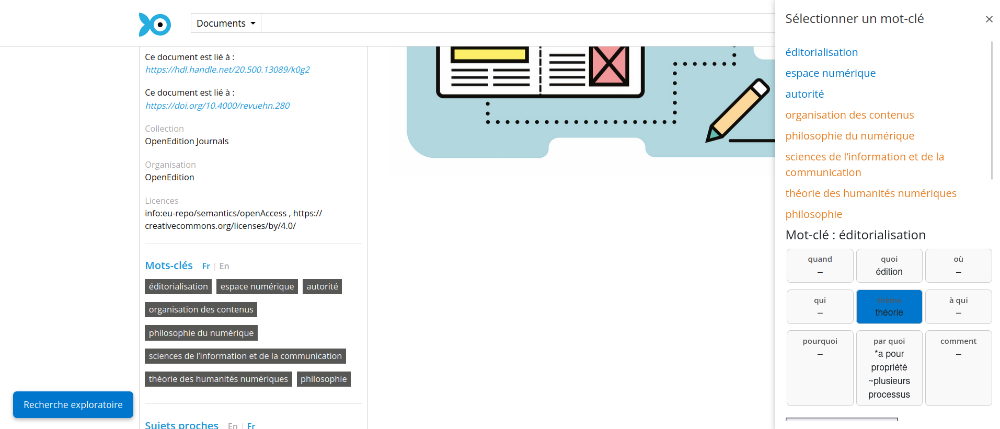
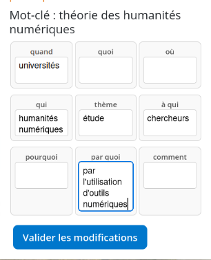

## The Problem with Convincing Algorithms

<!-- you might think that the best possible outcome is for algorithms to be convincing -> that the goal would be to have users trust blindly the system you put into their hands -->

Persuasiveness of Computer Systems is not new : 

Perceived objectivity [@dijkstraPersuasivenessExpertSystems1998] is not mitigated despite blindness to an algorithm's process[@loggAlgorithmAppreciationPeople2019] and an algorithm's outputs can influence someone even after the system is removed [@vicenteHumansInheritArtificial2023].

## Consequence

Exacerbation of old problems :

Shadow AI 
Cognitive offloading [@kosmynaYourBrainChatGPT2025] 

If we do not question the authority of the machine, are we becoming the assistant's assistants? 

## Questions 

- Why do people rely on chatbots? 

## Questions 

- ~~Why do people rely on chatbots?~~ 
- How can we design systems that foster engagement and critical thinking? 

<!-- ## Theoretical framework

Critical AI literacy [@goodladEditorsIntroductionHumanities2023] -->

## Can an Eror Become a Solucion?

What if the system's potential for errors was exposed rather than concealed? 

---

<!-- did you catch that?
Did you feel the urge to correct that slide? -->

## Corrective Feedback: a Dialog in Practice

Tension between : 

- letting the machine shape our ideas 
- the desire to correct and begin a dialog

= the opportunity to shape new practices in research and pedagogy.  

## Example : IEML-RS

---

---

---

---

## Conclusion 

The dysfunctional [@vitali-rosatiElogeBugEtre2024] can be a fertile component of collaborative dialogical process between imperfect algorithms and the observed human tendency to correct. 

<!-- 
due 1st of Feb. Date 4-5 June 2026 @Udem

How can open social scholarship, with its focus on community, openness, and engagement, provide more generous frameworks for understanding and shaping the shifts brought about by an increasingly algorithmic culture(s)?
What opportunities and challenges do AI-driven systems present for the knowledge commons, public platforms, and scholarly engagement? -->

## Bibliography

<!-- ## Draft 

vicenteHumansInheritArtificial2023

  "the biased recommendations by the AI influenced participants’ decisions. Moreover, when those participants, assisted by the AI, moved on to perform the task without assistance, they made the same errors as the AI had made during the previous phase. Thus, participants’ responses mimicked AI bias even when the AI was no longer making suggestions." 

>The results of our three experiments support a human over-reliance on the recommendations of AI  systems70,71, and add the new finding of the inherited bias effect. Human trust in automation influences the tendency to over-accept algorithmic outcomes58,59 even when they are noticeably wrong. This means that humans are not only willing to rely on AI because they are “cognitive misers”, that take mental shortcuts when making  decisions, but also because they perceive artificial intelligence to be tr -->

<!-- 
## Presentation fodder 

- accentuate the tension between AI agent as assistants and us becoming the agent's agent by not questioning the authority of the machine: 

But one can wonder if, as in Losey's _The Servant_ we are not becoming dependent of them and if the roles will not be eventually reversed. Anil Dash warns that by using Atlas, OpenAI's browser defaulting to ChatGPT as a search engine, the user becomes the company's agent, scouring areas of the internet that OpenAI would never have any right to access, effectively subverting the expected roles [-@dashChatGPTsAtlasBrowser2025].

becoming invisible and perfect 'assistants' effectively influencing our thoughts and research. 

for presentation : expending on the consequences of cognitive offloading 
Anecdotal evidence of the consequence of this subtle cognitive offloading abound : from researchers leaving the writing of essential article parts to generative AI [@strzeleckiMyLastKnowledge2025] 

for presentation : examples of GenAI becoming the teacher : Examples of corrective feedbacks typology fed in a prompt for an AI assistant in second language acquisition have demonstrated their efficiency in the classroom [@jinalpurohitFeedbackLearnerMotivation2025].  

+ https://journals.sagepub.com/doi/full/10.1177/07356331251359430 specialized prompting with CoT for tailored English writing skills.

  -->

