## Introduction

<!-- This paper reflects on the current transformations of information retrieval systems, recommendation
systems, and automated literature review tools. Despite their potential impact on innovation and
discoverability in science, the role of these systems remains largely invisible. The integration of
AI systems into all phases of information retrieval suggests that new, discrete research practices —
such as those described by Clavert and Muller—are becoming entrenched without full awareness of
their impact on knowledge production. In this paper, I will update the stakes of scholarly literature
discoverability through a state-of-the-art review of AI research assistants, assessing their influence
on the scientific ecosystem and emerging discrete research practices. I will also propose avenues for
reflection, design suggestions, and architectural frameworks for recommendation and information
retrieval systems tailored to address these major challenges -->

**This presentation highlights the added value of creating environments that foster serendipity as opposed to strict findability in the context of documentary search driven by "AI-research-assistant".** 

<!-- Contributions: 

- Description of the possible influence of automation features for semantic tasks within the ecosystem of scholarly content production and dissemination. 
- Theoretical contribution: serendipity as a support for human agency and an epistemological alternative to dominant Information Retrieval (IR) paradigms.
- Seven design principles for enhancing human agency for documentary research tools. -->

## Outline 

1. Context: AI research assistants and documentary research  
2. Serendipity as an epistemological alternative to the discoverability regime materialized by current AI tools.
3. Proposals for developing tools that value human agency.

# AI Assistants and Documentary Research  

## Basic Definitions

AI: "automation of cognition" @abbassEditorialWhatArtificial2021

Documentary Research: human led process of research and selection of documents. 

Information Retrieval: technical matching between a query and one or more documents. 

## From Traditional Search Engines

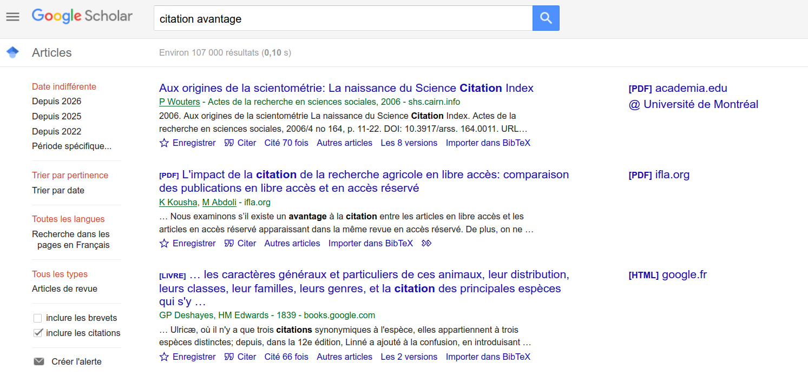

## To "AI-research assistants"

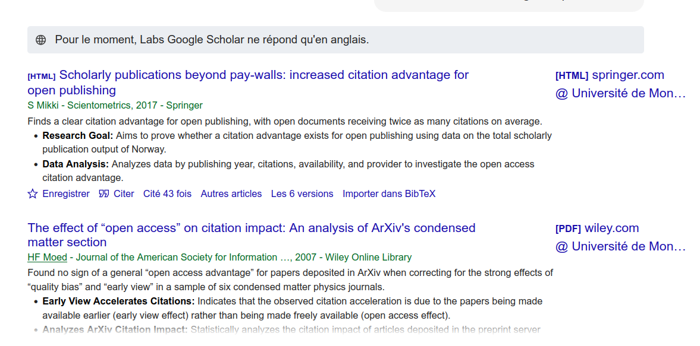

<!-- 
## A Growing Demand?

@silvestredesacyNoteLexperienceLIA2024 at Isidore :

> We observe strong expectations from certain Social and Humanities Sciences (SHS) communities regarding artificial intelligence algorithms, particularly for **high-value tasks** such as fine annotation of textual corpora, knowledge engineering, image processing, text document correction, sequential data processing, and processing of 3D-restored environments, among others.

> **The objective for SHS research actors is to view AI not merely as a technology, but primarily as a socio-technical system to be invested in, appropriated, and understood.** This could potentially be realized through a role for research infrastructures. The aim would be to contribute to investing in these socio-technical systems by establishing transparent and educational research services and infrastructures, **enabling researchers to choose specific AI algorithms based on their research questions with full awareness of the implications of such choices.** -->

<!-- 
>Nous constatons de fortes attentes de la part de certaines communautés SHS autour des algorithmes d’intelligence artificielle, notamment autour de tâches à forte valeur ajoutée (annotation fine de corpus textuels, ingénierie des connaissances, traitements d’images, correction de documents textuels, traitement des données sérielles, traitements d’environnements restitués en 3D, etc.). »

> objectif pour les acteurs de recherche SHS de voir l’IA non pas comme une simple technologie, mais avant tout comme un dispositif socio-technique à investir, à s’approprier, et à comprendre. Tout ceci pouvant se concrétiser dans un éventuel rôle pour des infrastructures de recherche. Il s’agirait alors de contribuer à investir ces dispositifs socio-techniques à travers la mise en place de services et d’infrastructures de recherche transparents, pédagogiques, leur permettant d’adapter le choix de tel ou tel algorithme d’IA en fonction de leur problématique de recherche et en pleine connaissance des implications d’un tel choix. -->

In order to understand the implications of the integration of "AI-based systems" within information retrieval infrastructure, let's look at the possible places of its intervention.

## Typology of possible AI interventions in scientific production ecosystem

1. Writing/rephrasing
2. Metadata creation: disambiguation, keyword creation, subject classification, abstract generation. 
3. Query expansion: thesaurus, ontology vs. _query expansion_
4. Information retrieval method: lexical search (boolean, regex, TF-IDF, BM25) vs. so-called semantic search (vector comparison). 
5. Ranking of result list 
6. Enrichment of the results list 
7. **Synthesis and analysis of sources: RAG, deep search**

Typology based on @tayWhatWeActually2025.
<!-- 
Principles suggested later concern documentary search at large and not only deep search applications. -->

--- 

[source](https://app.undermind.ai/report/96d1ce264f5b976eac434514d16e2529a99968d6928b225d57859617b14beca1)

<!-- ## Reranking

Ranking of presented articles according to a relevance criterion relative to the query. 

1. Classic _Machine learning_ (training a model for ranking).

2. Vector comparison (query/article title): score = proximity. Example: Primo search assistant[^primo]

3. Evaluation by a 'gen AI' type LLM: ranking prompt or relevance categorization. Provide explanations: Example: Asta

4. Addition of external criteria Example: SemanticScholar, "highly-cited papers"

[^primo]: Source: https://knowledge.exlibrisgroup.com/Primo/Product_Documentation/020Primo_VE/Primo_VE_(English)/015_Getting_Started_with_Prim_Research_Assistant
 -->
<!-- 
---

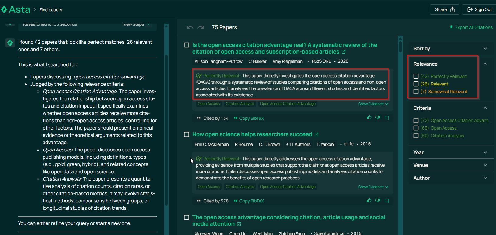 -->
<!-- 
## Enrichment of the results list -->

<!-- ## Article synthesis or literature review assistant

Synthesis of extracted articles to answer a natural language question => RAG. 

1. Simple RAG: Elicit, SciSpace (source: Semantic Scholar, OpenAlex), Semantic Scholar's TLDR function. 

2. _Deep research_: Agentic AI, specialization of multiple agents, returns a complete report in a few minutes. Specialized features Example: Consensus "Study Snapshot" feature.   -->

## Main risks with current shift toward deep search

- Confusion between search and analysis within research practices [@finnShapingHistoryResponsibly2026]
- Increased opacity : 
  - Which databases?
  - Based on metadata or full text ?
- Increased persuasiveness : 
  - Design favoring an authoritative output
  - "blank box"[@tayBlankBoxProblem2026]

## Evaluation of LLM-based applications from the user point of view

Evaluation of RAG and AI Research Tools : @archambaultEvaluationCuttingEdgeAI2024; @pattersonWhichAITools2025

Evaluation of recommander systems : @razaComprehensiveReviewRecommender2025. 

Broad design principles for RAG for historical corpus [@purenAlignerMethodeHistorique2026] :

  - traceability
  - contextualisation
  - auditability : transformations should be notified and evaluation can be made from a grid of clear criteria.

## Design principles 

Concrete proposals for Archival AI assistants : @finnShapingHistoryResponsibly2026 : 7 design principles : 

  - narrow over general purposes
  - search over analysis
  - tailor to collection first, user second
  - elucidate complexity
  - rigorous and open evaluation
  - transparency in design and communication
  - enable informed usage 

For Research Assistants :

- @tayBlankBoxProblem2026 focussing on reducing the "blank-box" effect of deep search applications : 
  - suggesting guiding sample prompts
  - creating hybrid UI with explicit filters (ex: for period ranges, doc types)
  - autocomplete guiding the prompts based on actual constraints
  - user validation of the LLM parsing of the initial prompt
  - explicit limitations of the systems
  - templates for common tasks

 <!-- put focus on serendipitous findings and discovery with AI research assistants while remaining true to these guiding principles ?  -->

# Serendipity as an Epistemological Alternative

## Discoverability 

Innovation and research depend heavily on our ability to make new semantic connections.

Two faces: 

- **Findability**: accessing the information one is looking for (document indexing side)
- **Serendipity**: accidentally accessing what one did not know one did not know (user side)

<!-- Much studied in the context of e-commerce and dissemination of cultural content, otherwise by information and documentation sciences for discoverability in science.   -->

Thesis: 

Current AI research assistants focus mainly on findability to meet basic search engine standards; however, because they inherently incorporate interpretative steps, making serendipity a core design goal could be a valuable direction to pursue.

Serendipity is a process of filtering and connecting with new information : as a design goal, it means putting at the center human judgment. 

## Serendipity 

<!-- 'Browsing' is a 4-dimensional process [@riceResultsMotivatingThemes2001]: 

1. the act of scanning;
2. the presence or absence of purpose;
3. the specificity of search outcomes or goals; 
4. and knowledge about the resource and object sought. -->

Serendipity is both the process and the result of a '_chance encounter_'. 

![Modeling of serendipity [@makriComingInformationSerendipitously2012]](img/modelSerendipityMakri.png)

Importance of the **reflexive dimension** to distinguish serendipity from chance.
<!-- 
## Serendipity, Creativity, and LLMs

> The work of any creative system can be viewed as a process of search through a space of possibilities or a ‘possibility space’” 
> --- @perkinsInsightMindsGenes1994 cited by @bjornebornAdjacentPossible2022 

Latent space: the space of possibilities according to constraints defined by the algorithm developer, containing everything an algorithm is capable of predicting.  -->

## Serendipity in Science

Exploratory and serendipitous approaches in documentary research:

- "adjacent possible" [@kauffmanInvestigations1996; @bjornebornAdjacentPossible2022]: environmental constraints give rise to a negotiation between exploitation and exploration [@monechiWavesNoveltiesExpansion2017]

- exploit the profusion to generate unexpected connections [@batesDesignBrowsingBerrypicking1989; @erdelezInformationEncounteringIts1999]

- favor disciplinary bridging [@dumasprimbaultNaviguerDansSavoirs2023] 

<!-- Dumas Primbault: importance of pivot disciplines -->

<!-- ## Serendipity and Digital Technology

Exploration at the heart of the connected digital experience: 

> The political power of the Internet (1969-2009) lies in the preeminence given to a particular category of activity: exploration. The Internet was fundamentally constituted by the reorganization of action around exploration: it gave preeminence to experimentation over internalization, to uncertain fumbling over formal learning, to play and challenge over school examination. It structured skeptical, open, and curious communities.
> --- [@aurayTechnologiesLinformationRegime2011]

vs. the emergence of limiting algorithmic logics: 

> While it was felt that some element of control could be exercised to attract “chance encounters”, there was a perception that such encounters may really be manifestations of the hidden, but logical, influences of information gatekeepers – inherent in, for example, library classification schemes 
> --- [@fosterSerendipityInformationSeeking2003] -->

## Challenges for the Design of Environment Favoring Serendipity

Reproducibility and memory: how can we keep track of an exploratory path? how can we help a person recall the many steps leading to a resolution [@erdelezInvestigationInformationEncountering2004]?

Evaluation: how can we evaluate the impact of a finding? or the interest of a new search feature [@pouyllauUtiliserIsidorescienceRegard2023; @pouyllauDurabiliteRefactorisationInstruments2025]? how can we cater to all in a highly subjective process without falling into personalization bias (e.g. filter bubbles [@pariserFilterBubbleWhat2012])?

## Questions 

How can we design explainable systems that are at the center of environments that favor serendipity and critical exploration? And allow for reflexive interactions with the algorithm?

# Proposals : 7 principles for the design of LLM-based applications focussing on serendipity in documentary research 

## Report as Support for Expertise 

- Complete reports tracing the algorithmic mediation of the user's request to the response or list of articles returned (reranking criteria, query reformulation prompt, etc.). 

- Expose the tool's limitations and capabilities Example: Barista, the query builder assistant on Impresso  [@finnShapingHistoryResponsibly2026]

---

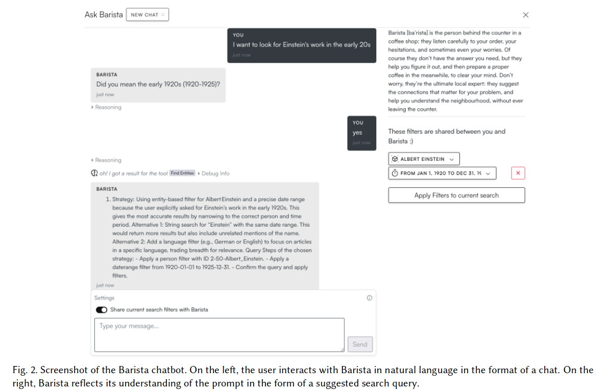

<!-- 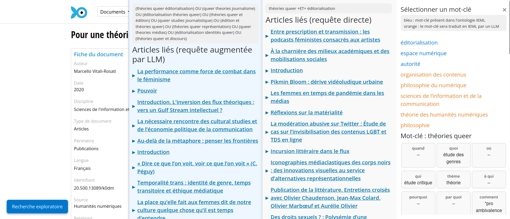 -->

## Specialization of Classification and Quantification 

Similar to the "narrow over generalisation". 

Specialized classification assists human judgment.

Example: Evidence-RAG from the _Journal of Digital History_: assists the editor in presenting the evaluation of an article: situates the relevance of a comment relative to the evaluated article [@guerardInteractiveEvidenceRAGPeer2026]. 

## Make Room for Uncertainty

**Expliciting uncertainties and tool limitations.** 

A paradigm shift that Digital Humanities approach can embrace:

> « Can we conceive of models of interface that are genuine instruments for research? That are not merely queries within pre-set data that search and sort according to an immutable agenda? How can we imagine an interface that allows content modeling, intellectual argument, rhetorical engagement? » 
> --- [@druckerPerformativeMaterialityTheoretical2013]

Counterfactualization: identifying which explanatory variable should change in the algorithm to obtain a different result: make alternative possibilities explicit. [@chevillonAlgorithmesQueersPerturber2026]

Example: the _Provotype_ [@boerProvotypesParticipatoryInnovation2012] 

## Exaptation and Imperfection

(evolution theory): "opportunistic selective adaptation, favoring characteristics that are useful for a new function, for which they were not initially selected."

In other words : allowing the tool to become the result of a misuse in the process of appropriation [@tchounikineAppropriatingTechnologyHow2025]. 

Example: "Misappropriation" of the search function of Gallica's famously flawed search engine [@dumasprimbaultDecouvrabiliteCommePrise2025]

## Friction 

Generative adversarial networks (GANs) [@goodfellowGenerativeAdversarialNetworks2014] and antagonistic AI [@caiAntagonisticAI2024]. 

Spirit of contradiction: allowing correction and evaluation by the user. @schneiderImperfectAIUphold2026 tomorrow at INKE !

Example: IEML-RS, a recommander system, [@schneiderReclaimingEpistemicAgency2026] allows for a basic semantic decomposition of a concept in 9 fixed facets (i.e. IEML), however the "translations" done by a LLM (prompted along with a few example), are mediocre encouraging the user to correct . 

<!-- ---

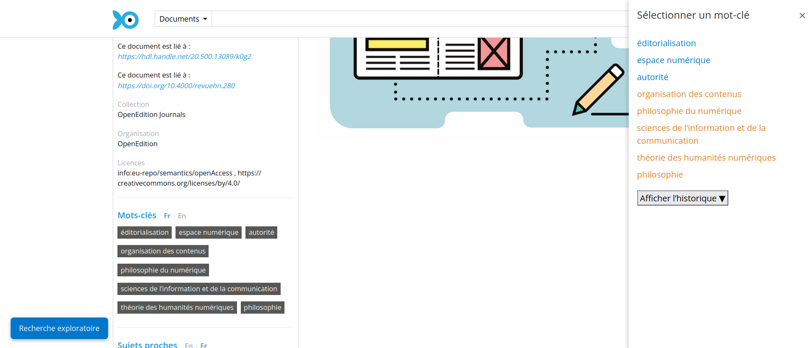

---

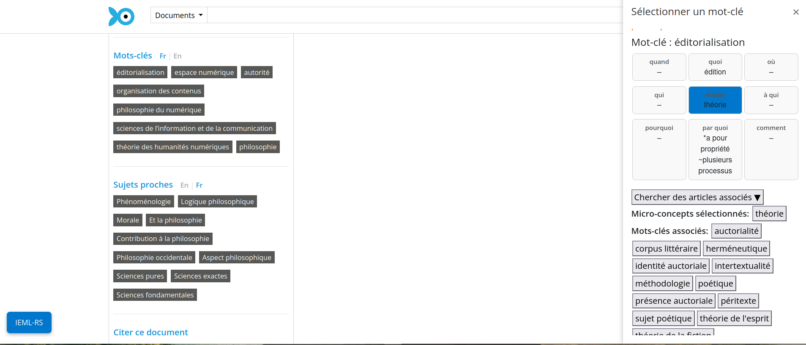 -->

---

<!-- 
(Pierre Lévy's idea: allow correction of the automatic translation in IEML generated by Gemini). -->

## Exploration Through Disorderliness

Example: [françaiS au pluriel](https://www.enfrancaisaupluriel.fr/library?mode=tree) [@suchetFrancaiSAuPluriel2026]

---

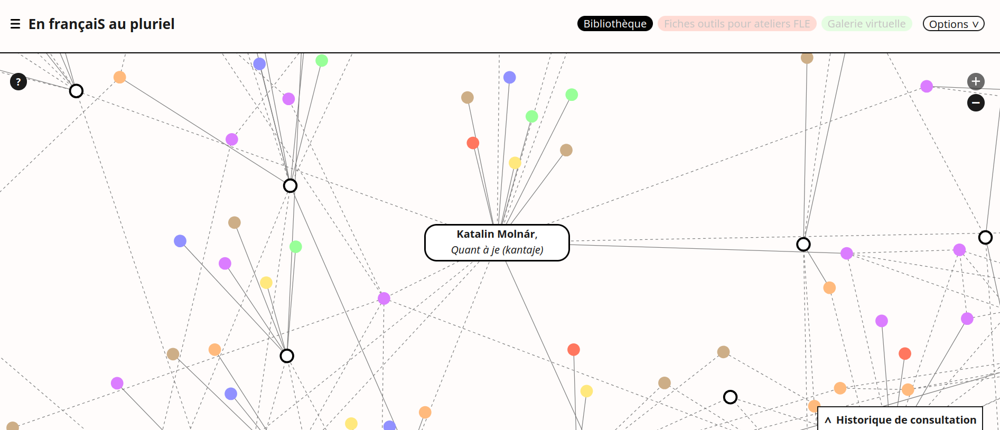

--- 

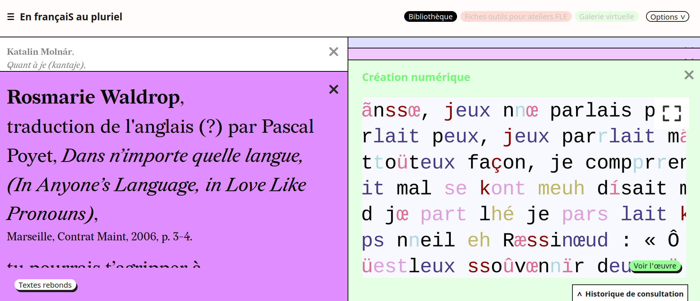

---

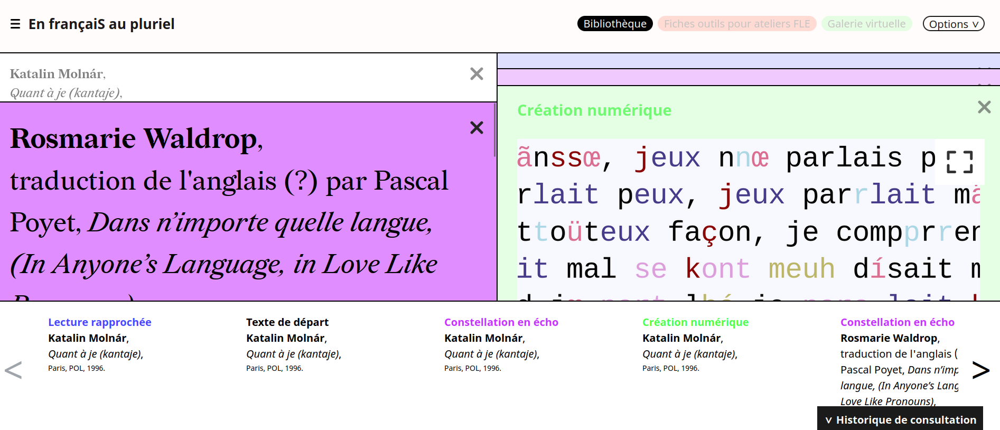

## Value in Underexplored Facets

Highlight underexplored semantic facets to offer other paths. 

Example: typology of citation type -> citation network beyond quantification

---

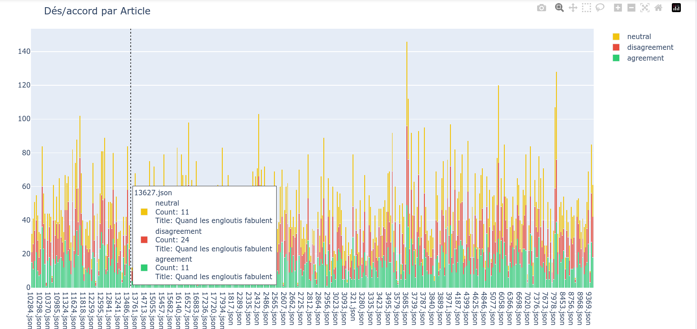

---

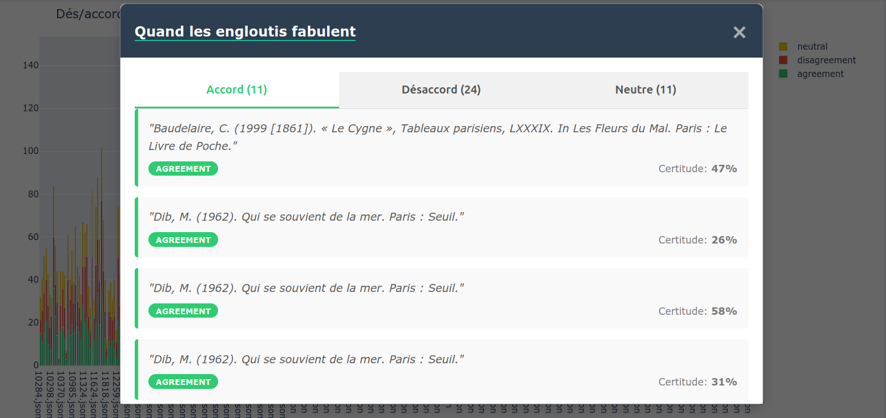

<!-- 
## Summary of Proposals

- Make room for uncertainty
- Disorder  
- Explore other facets 
- Restitution as support for expertise
- Specialization of classification and quantification
- Exaptation 
- Friction -->

# Conclusion
<!-- 
Serendipity as a process of reflective selection in the face of a mass of documents can be a proven vector of creativity to materialize human agency.  -->

Frictionless interfaces tend to blur the lines between research and analysis whereas environments fostering a reflective process of selection help put value into the findings themselves. 

<!-- 
Developing tools that make choices explicit, and leave room for many diverging realities can highlight human agency.  -->

## Acknowledgements 

This work benefited from a grant thanks to funding from the Consulat General de France au Quebec and the Fonds de recherche du Québec, which enabled a research stay at the Huma-Num Lab via the Sophie Germain mobility grant. [https://doi.org/10.69777/381645](https://doi.org/10.69777/381645)

Research funded by the CRSH through the Revue3.0 partnership project as well as a grant from the Circé Network for mutualization and research for scientific journals. 

## Bibliography

::: {#refs}

:::

## Ecosystem of production and dissemination of scientific papers

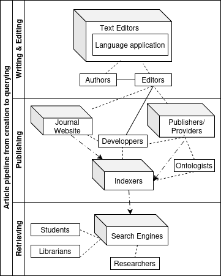 
