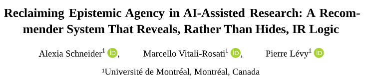
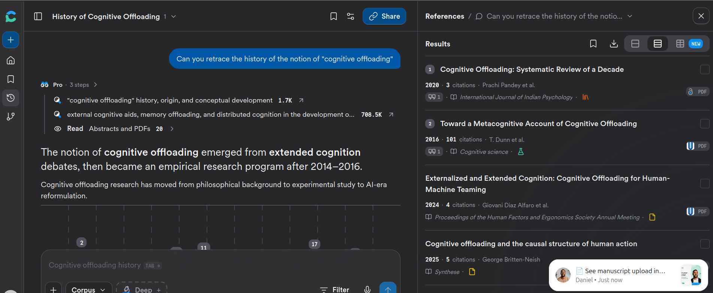
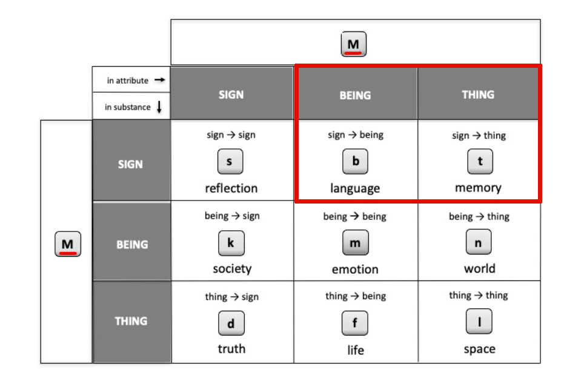
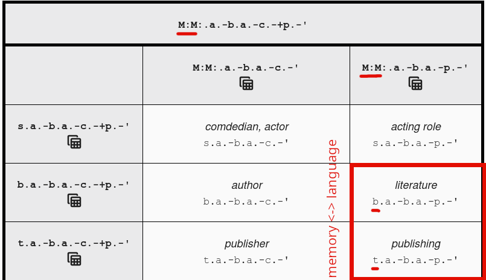
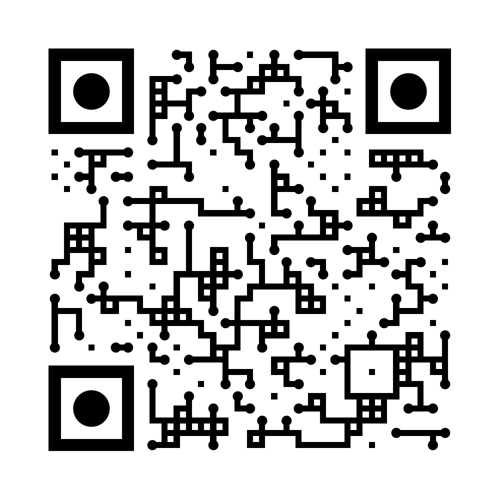

## Presentation outline

- Introduction  
- Brief SOTA
- Demonstration
- Evaluation  
- Conclusion

<!-- 5 min par partie + 1 min conclusion -->
<!-- 20 min + 10 QA-->
## Introduction

**Larger context of the research:** Scientific documentary research (esp. for SSH researchers)

Recommendation systems have changed: from algorithms that extracted "you might also like" suggestions alongside search engine results to tools that support natural language queries and provide full reports. 

---


---



## Problem Statement

With the current adoption of these "AI research assistants" we are seeing a change in research practices. With it comes certain aspects that we have still to grapple with:

- A focus on 'findability' i.e. finding what we already know we know as opposed to 'serendipity': finding what we didn't know -> risk of increasing confirmation bias [@underwoodTheorizingResearchPractices2014] with natural language querying. 
- Blurring of different cognitive tasks: search and analysis [@finnShapingHistoryResponsibly2026; @derewalEvaluatingLLMResearch2025].
- Still complex evaluation of an opaque and quickly-changing tools: opacity of ranking, filtering, and synthesis (when applicable) [@archambaultEvaluationCuttingEdgeAI2024; @pattersonWhichAITools2025; @tayReproducibilityInterpretabilityAcademic2025].
- Opacity of the systems themselves: citation concentration (Matthew effect [@mertonMatthewEffectScience1968]) with potential reduction of the epistemic space for discovery [@nielsenGlobalCitationInequality2021; @vargaNarrowingLiteratureUse2022].
- Incentives to maintain authoritative tools and rely on long documented persuasiveness of algorithms and computer outputs [@dijkstraPersuasivenessExpertSystems1998; @loggAlgorithmAppreciationPeople2019; @vicenteHumansInheritArtificial2023]. 

<!-- filter bubbles [@pariserFilterBubbleWhat2011], -->

## Research Question

How can we design explainable systems situated at the center of an environment that fosters critical exploration and enables intellectual engagement with the algorithm?

## Examples of Alternative Recommendation Systems

- `Bridger` by @portenoyBurstingScientificFilter2022 exposes researchers to authors outside their usual intellectual networks to promote disciplinary cross-pollination.
- `VITALITY` by @narechaniaVITALITYPromotingSerendipitous2022 proposes a literature review approach based on visualization of word embedding space from a seed article. 
- `STAK` by @martinSTAKSerendipitousTool2017 was inspired by the material affordances of physical libraries, attempting to recreate spatialized navigation environments.

<!-- 
## IEML-RS: Theoretical Framework

Initial question of the IEML work: What does a direct comparison between a symbolic ontology and a semantic search based on GMLs reveal about their underlying epistemic models?

- Discoverability (findability and **serendipity**)

- Anchoring the *Performative Materiality* of Digital Humanities as defined by @druckerPerformativeMaterialityTheoretical2013:

> "Can we conceive of models of interface that are genuine instruments for research? That are not merely queries within pre-set data that search and sort according to an immutable agenda? How can we imagine an interface that allows content modeling, intellectual argument, rhetorical engagement?" 
> --- @druckerPerformativeMaterialityTheoretical2013 -->

## IEML

Information Economy MetaLanguage (IEML) [@levySemanticComputingIEML2023] != YAML


### Sentence or higher level of conceptualisation 

Semantic Facet|Value
---|---
Theme/root|theory
What|edition or publishing
Who|-
To whom|-
By which means|*has property ~multiple process
When|-
Where|-
Why|-
How|-

: IEML decomposition matrix based on 9 semantic facets for the keyword **editorialisation**


Rules : 

- the grid doesn't have to be filled 
- flexions are represented with \*, \~ 
- le concepts have to be in the IEML dictionnary: [https://ieml.intlekt.io/](https://ieml.intlekt.io/)

### Lexical level of deeper level of conceptualisation

**publishing**: t.a.-b.a.-p.-'

Rules:

- Any concept can be described from the combination of 6 'primitives': 
E (emptiness), U (virtual), A (actual), S (sign), B (being), and T (thing).
- A combination between two 'primitives' is a lowercase letter: there are 26 symbols. 
- There are up to 6 layers of semantic desambiguisation represented with punctuation (ex: the dot is the first layer). 
- Each layer is represented by a triad following the syntax: substance (role 1), attribute (role 2), and mode (role 3). An empty space in a layer is simply not represented. 





---


## Summary of Main Features

- Exploration and extansion of a semantic field thanks to IEML starting from a keyword describing the seed article.
- Automatic generation and correction (human-in-the-loop) of missing 'translations'.
- Construction of a query sent to the search engine Isidore.
- Side by side comparison of article lists retrieved from the user-selected keywords **and** an LLM-augmented query from those same keywords.

# Prompts

## "Translation" Prompt into IEML

**English version**:


You are a semantics expert. You must semantically decompose the keyword "${keyword}" based on the following 9 values:
'theme, who, what, to whom, by what means, when, where, why, how'
\#\# Examples
\$\{examples\}

\#\# Dictionary Words
You must use the words below to define the keyword "${keyword}":
\$\{context\}

Your response must take the form of a CSV with 9 columns; the column headers are:
'theme, who, what, to whom, by what means, when, where, why, how'
It is not necessary to fill all fields. A field can remain empty between two commas, as in the examples.
Respond only with a final CSV line, without explanation.


**Original in French:**

``` 
Tu es un expert en sémantique. Tu dois décomposer sémantiquement le mot-clé "${keyword}" à partir des 9 valeurs suivantes :
'thème, qui, quoi, à qui, par quoi, quand, où, pourquoi, comment'
## Exemples
${examples}

## Mots du dictionnaire 
Tu dois utiliser les mots ci-dessous pour définir le mot-clé "${keyword}":
${context}

Ta réponse prendra la forme d'un CSV à 9 colonnes, les entêtes de colonnes sont: 
'thème, qui, quoi, à qui, par quoi, quand, où, pourquoi, comment'
Il n'est pas nécessaire de remplir tous les champs. Un champs peut rester vide entre deux virgules, comme dans les exemples. 
Répond uniquement avec une ligne CSV finale, sans explication.
```

## Query Augmentation Prompt

**English version:**

Generate 10 variants of the following Boolean query "\$\{keywords\}". Combine the proposed queries using the OR operator as in the example: 

Keywords: "impact of climate change on biodiversity". 

Response: "(climate change biodiversity impact) OR (effects of climate change on ecosystems) OR (biodiversity loss due to climate change) OR (climate change species extinction) OR (impact of global warming on wildlife) OR (effects of climate change on ecosystems and species diversity) OR (how climate change impacts wildlife and biodiversity) OR (climate change consequences for biological diversity) OR (relationship between climate change and loss of biodiversity) OR (climate change threats to flora and fauna diversity) OR (impact of climate change on biodiversity)
Now it is your turn with "${keywords}". 

Respond only with the query without giving any explanation.


**Original in French:**:


```
Produit 10 variants de la requête booléenne suivante "${keywords}". Combine les requêtes proposées à l'aide de l'opérateur OU comme dans l'exemple : Mots-clés:  "impact of climate change on biodiversity". Réponse: "
(climate change biodiversity impact) OU (effects of climate change on ecosystems) OU (biodiversity loss due to climate change) OU (climate change species extinction) OU (impact of global warming on wildlife) OU (effects of climate change on ecosystems and species diversity) OU (how climate change impacts wildlife and biodiversity) OR (climate change consequences for biological diversity) OU (relationship between climate change and loss of biodiversity) OU (climate change threats to flora and fauna diversity) OU (impact of climate change on biodiversity)
C'est à ton tour avec "${keywords}". Répond uniquement avec la requête sans donner d'explication.
```

## Evaluations

- Quantitative evaluation of the translation produced by the LLM in IEML (RAG to anchor translations in IEML dictionary words).
- Qualitative evaluation (user study) of the application as a whole.

## Evaluation of Automatic Translation into IEML

<div style="font-size: 20px;">
word to translate|theme or root|who|what|to whom|by what means|when|where|why|how
---|---|---|---|---|---|---|---|---|---
**digital space**|digital technique|-|space|-|-|-|-|-|-|
**singer**|play or sing a melody|person|-|-|*by means of voice|-|-|-|
</div>

Expected translation

---

<div style="font-size: 20px;">
word translated|theme or root|who|what|to whom|by what means|when|where|why|how
---|---|---|---|---|---|---|---|---|---
**digital space**|space|cyberspace|everyone|via internet and social networks|-|virtually|monetize and share information
**singer**|music|singer|performing a song|to an audience|by their voice|-|-|to express an emotion|using song metadata
</div>

Examples of translations produced by rag-llama-fewshot. 

LLMs still do not perform well for structured meaning representation e.g. with Abstract Meaning Representation (AMR) [@ettingerYouAreExpert2023]. 

## Evaluation Summary

Models (via Together AI API):

- Meta-Llama-3-70B-Instruct-Turbo
- Gemma-3n-E4B-it
- GPT-oss-20B

model/strategy|BLEU|Cosine|avg|
------|-----|----|----|
baseline|0.056|0.515|0.286
llama_fewshot|**0.0222**|**0.555**|**0.289**
gemma_fewshot|0.020|0.491|0.255
openai_fewshot|0.0167|0.498|0.257
llama_zeroshot|0.0129|0.514|0.263
gemma_zeroshot|0.0160|0.479|0.248
openai_zeroshot|0.016|0.493|0.254

: Table of model evaluation for automatic translation

The context (i.e., dictionary entries) marginally improves performance.

Limits: 

- BLEU and cosine are meant for the evaluation of natural language translation therefore are ill-suited for structured semantic language parsing.
- the retrieval part of the RAG makes choices that can potentially go against the principles of IEML representation. For instance the IR for 'editorialisation' will very likely retrieve from the IEML dictionnary 'publishing' with a vector-base search or 'edition' with BM25 but probably not 'theory' as these are farther apart. But the main advantage of IEML lies in its ability to bridge faraway concepts from common denominators. 

## Qualitative Evaluation of IEML-RS

6 users (PhD in Digital Humanities). Demonstration followed by 10 minutes of usage observation and a 15-minute interview.

Criteria:

- User-friendliness,
- Usefulness.

Features:

- Navigation (keywords and concepts),
- Translation into IEML,
- Comparison of article list panels.

## User Study

- **Ease of use**:
    - Confusion regarding the integration of concepts into the query,
    - Automatic translation and validation: initial hurdle (limited database),
    <!-- - **Direct integration into the host search engine**: main improvements (latency, more detailed article information, distinction between 'query building' and 'article search' functions) -->

- **Usefulness**:
    - Reveals strong disparities in user research practices (network and contextual IR vs. keyword search),
    - Strength: comparative panels,
    - Mixed-quality translation encourages **user agency and dialogic and collaborative work with LLMs** [@schneiderImperfectAIUphold2026].

## Conclusion and Perspectives

Example of an environment design fostering serendipity.

Tools being developed in Digital Humanities:

- Barista from the Impresso project: query building assistant [@finnShapingHistoryResponsibly2026]
- Ongoing developments at Isidore for RAG limited to specific use cases [@sacyLireDifferentesEchelles2025]
<!-- - Evidence-RAG from the JDH (to assist in the evaluation of reviewer comments during the peer review process) [@guerardInteractiveEvidenceRAGPeer2026]. -->

## Acknowledgements

Research funded by the SSHRC through the Revue3.0 partnership project, as well as a fellowship from the Circé Network and the Publica Coalition for mutualization and research on scientific journals.

## Thank you for your attention!

Link to download the Firefox plugin:

::: {.align-center}

{width=50%}
:::

## Bibliographie

::: {#refs}
:::


# Screenshots

---


---


---


---


---


---


