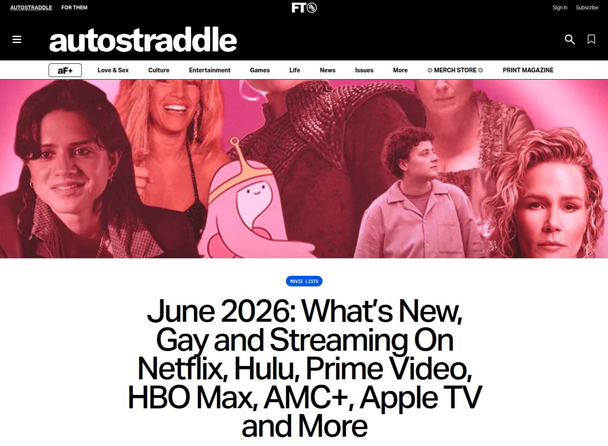
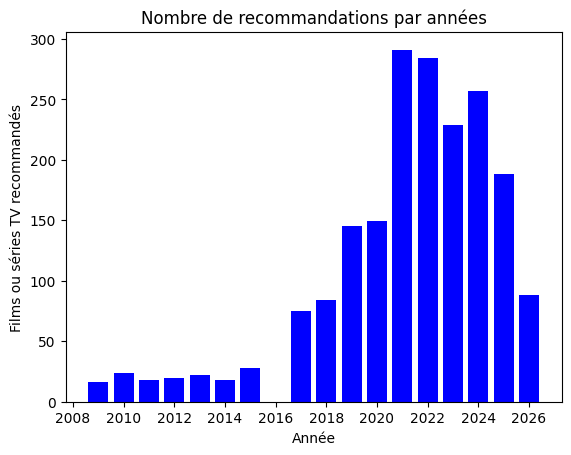
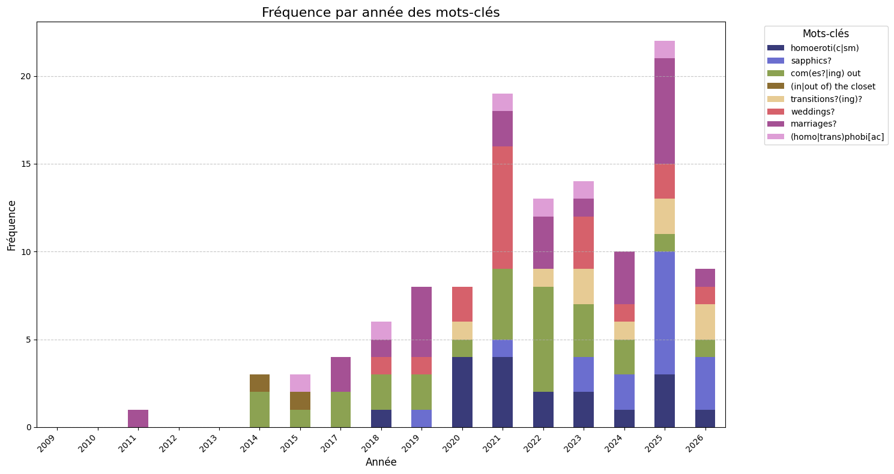
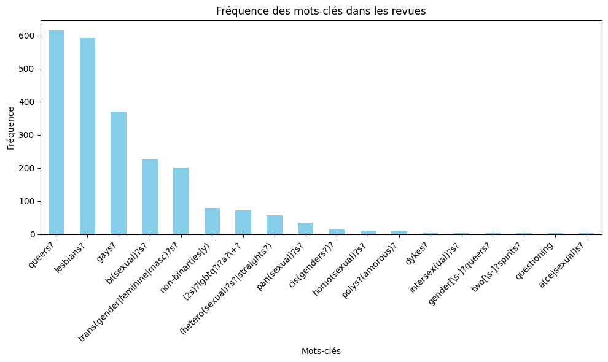
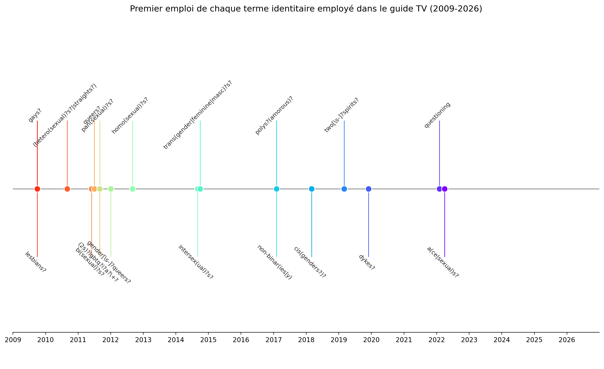

>A very intense film in which there is A SEXUAL SCENE involving rapidly unraveling 	ballerina Natalie Portman and freewheeling dancer Mila Kunis. I feel like they’re gonna put this in the LGBTQ Stories section and I am going to side-eye that. 
> --- Riese Bernard au sujet de l'ajout de _Black Swan_ au catalogue d'Amazon Prime Video en juin 2021

## Questions de recherche

1. Comment est-ce que le guide TV d’Autostraddle évolue avec les environnements de diffusion cinématographique et télévisuel états-unien ?

2. Quels sont les termes employés pour que la communauté réunie par Autostraddle s'identifie elle-même et identifie des films ou séries qui lui sont pertinents ?

## Méthodologie 

Web Scrapping puis extraction manuelle des 1977 films et séries recommandés accompagnés du commentaire/revue.

Extraction des termes relatifs à la diversité de genres et de sexualité avec des expressions régulières (regex). 

<!-- year|count
--|--
2009|16
2010|24
2011|18
2012|20
2013|22
2014|18
2015|28
2016|0
2017|75
2018|84
2019|145
2020|151
2021|291
2022|284
2023|229
2024|257
2025|188
2026|88

: nombre de films et séries recommandés par Autostraddle  -->

## Résultats

2009 - 2015 communauté restreinte à l’écran et en ligne

2017-2020 : multiplication des représentations et stratégie d’optimisation

2021-actuel : diversification thématique, déclin quantitatif et confirmation du role médiatique du site

--- 

---

---

## Références 

Cameron, K. (2017). Constructing queer female cyberspace : The L Word fandom and Autostraddle.com. Transformative Works and Cultures, (24). https://doi.org/10.3983/twc.2017.846

Ng, E. (2013). A “Post-Gay” Era? Media Gaystreaming, Homonormativity, and the Politics of LGBT Integration. Communication, Culture & Critique, 6(2), 258‑283. https://doi.org/10.1111/cccr.12013

Obbard, K., & McLean, L. (2024). Queering the System from within : Autostraddle as a Method for Future Digital Worlds. Australian Feminist Studies, 39(121), 371‑391. https://doi.org/10.1080/08164649.2024.2306608

Rapports GLAAD "Where we are on TV": https://glaad.org/research/page/1

